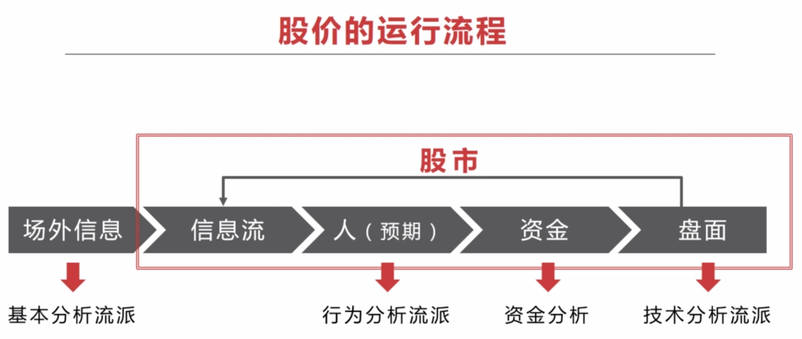

散户如何建立交易体系
====================
建立一套在股市里属于自己的持续复利的方法。

找几个好股票，做一个有耐心的人。从时间和空间上来看找到一支好股票很难。

一个成功的投资，可以从几个方面学习：
- 建立适合自己的投资交易系统；
- 执行投资交易系统并养成习惯；
- 掌握股市的熊牛发展规律；
- 能在牛市逃顶和熊市抄底。

# 建立适合自己的投资交易系统

投资交易系统分为两个部分：机会识别、交易控制，两者缺一不可。

## 机会识别

如何识别一个好的机会，可以从以下几点入手：
- **眼光**，投资的眼光应基于扎实的技术功底，明白主流行业的发展趋势，仔细研究利润行业的龙头股和潜力股。
- **判断力**，根据行业的发展趋势和技术面的分析，对股市有自己的见解，不卑不亢，有自己的判断力。
- **盘感**，高手所谓的盘感，多看经典的 K 线图，复盘。

## 交易控制

不论市场如何变化，做好自己的交易控制，打好手上的牌：
- 成本，如何把握成本
- 利润，如何保证利润
- **执行力**，建立检查清单，根据检查清单让自己尽可能的保持理性、客观和良好的执行力，并养成好习惯。执行合一。

_打破自己的固定思维，你看好的那支股票有可能不是那么回事，要敢于认错，调适好自己的方向；要有逆向思维，它的下跌逻辑是什么，可能下跌多少（总是反过来想）_。

# 股价的运行流程

``信息 --> 人 --> 资金、筹码 --> 盘面K线--> K线引申出各种技术指标``

技术分析流派，透过 K 线去知道市场正在发生什么，去感觉市场；学技术分析的人无数，但真正入门的不多，需要真正的理解技术分析。

**技术**，仅能提供方向和进场信号。只有真正掌握了技术分析，才可以达到 90% 以上的正确率；**上涨空间**无法确定，是进场后才知道的，空间是市场给的。

理解透彻技术分析流派，研究热点板块，有资金追逐，空间就更大。

# 优秀的技术交易系统需要具备的条件
- 概率高
- 赔率高
- 资金管理

## 概率
进场前，绝对不赌，只做大概率；进场后，看市场，空间是市场给的。因此，资金管理显得非常重要。

### 提高概率：
- 牛市：傻子都能赚到钱
- 政策：政策支持的行业/概念；国家坐庄，有资金的追逐就有牛股
- 符合人性：曹刿论战，通常 6 ~ 8 天或 11 ~ 13 天回调一次，把握时间节奏
- 顺应趋势：上涨的时候更容易上涨，下跌的时候更容易下跌；主力均线、量能规律

## 赔率
回报与风险比率要高。

### 提高赔率：
- 原则上盈亏比 > 3:1，例如：止损 1 块钱，上涨空间大于 3 块钱；
- 大级别机会，小级别止损：周线级别的机会，在日线上止损；
- 大顺-中逆-小顺：大趋势向上，有一个回调，同时在小级别上有一个上升再买入；
- 短线过度成中长线：短线赚钱了过度成中长线。

主力坐庄的基本步骤是：吸货、洗盘、拉升、震仓、出货。

## 资金管理

原则：利润少低仓位，利润大高仓位

初入场：以损定仓，主动管理资金回撤，不设止损不入场。
- 损：愿意承受的亏损额度
- 无论市场有多凶险，资金回撤是可控的

加减仓：截断亏损，让利润奔跑
- 跌了，不符合逾期，减仓/清仓
- 涨了，符合预期，节奏点加仓

净值曲线即一切：
- 小仓位小亏
- 小仓位小赚
- 大仓位小赚
- 大仓位大赚

_炒股跟时间不成正比，思维要比经验重要的多，形成好的习惯，不断的实践，不要把运气当作你的能力。_

_保持客观、保持理性、保持头脑清醒；盈利模式是有适用边界的，技术是分析、判断的一个依据，不要刻板、教条，股市是人的股市，是活的。_

_学会把赚到的钱往外面提，落袋为安。_

# 相关链接
- [02.K 线的识别和联系](https://github.com/IamDingj/FinancialHub/blob/master/FBSHG/02.K%20%E7%BA%BF%E7%9A%84%E8%AF%86%E5%88%AB%E5%92%8C%E8%81%94%E7%B3%BB.md)
- [03.节奏点](https://github.com/IamDingj/FinancialHub/blob/master/FBSHG/03.%E8%8A%82%E5%A5%8F%E7%82%B9.md)
- [04.技术指标](https://github.com/IamDingj/FinancialHub/blob/master/FBSHG/04.%E6%8A%80%E6%9C%AF%E6%8C%87%E6%A0%87.md)
- [05.资金管理](https://github.com/IamDingj/FinancialHub/blob/master/FBSHG/05.%E8%B5%84%E9%87%91%E7%AE%A1%E7%90%86.md)
- [06.富伯说股总结](https://github.com/IamDingj/FinancialHub/blob/master/FBSHG/06.%E5%AF%8C%E4%BC%AF%E8%AF%B4%E8%82%A1%E6%80%BB%E7%BB%93.md)
