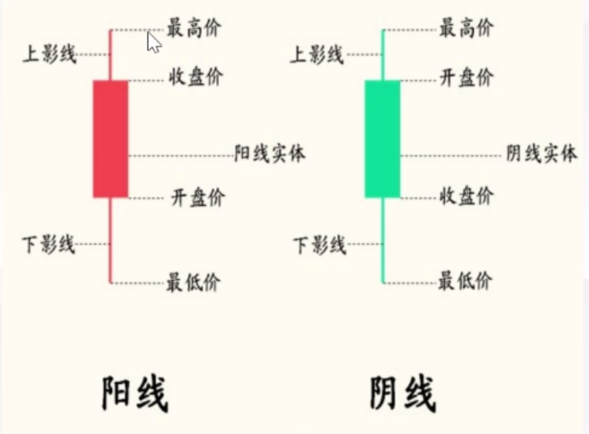
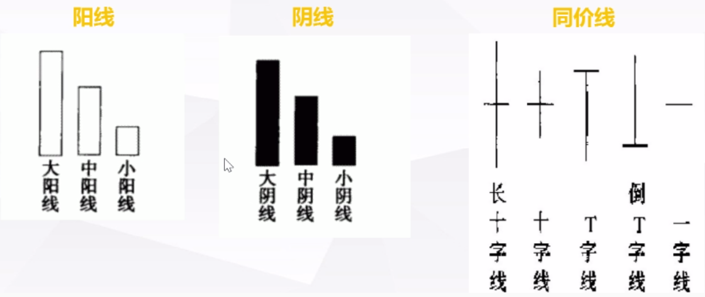
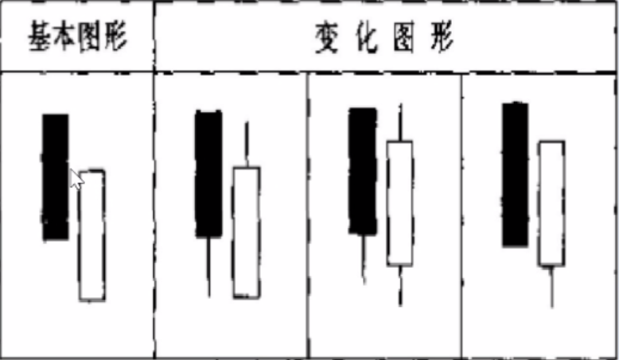
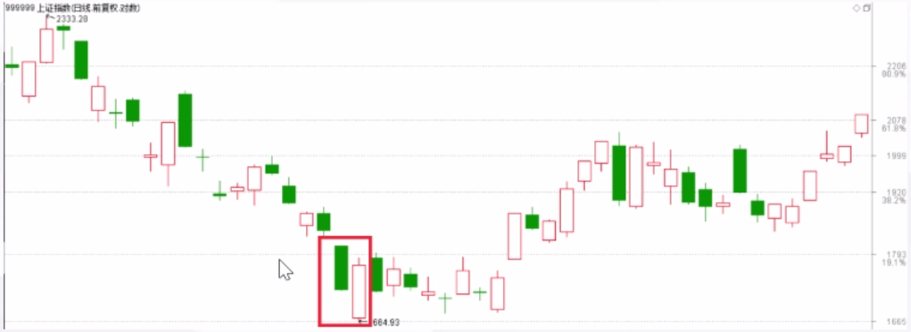
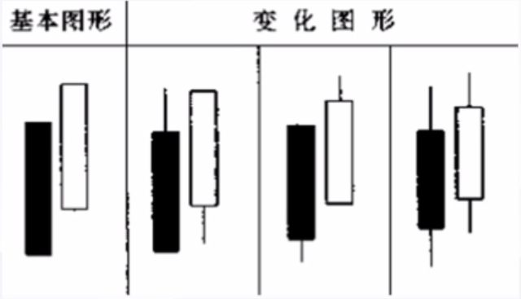
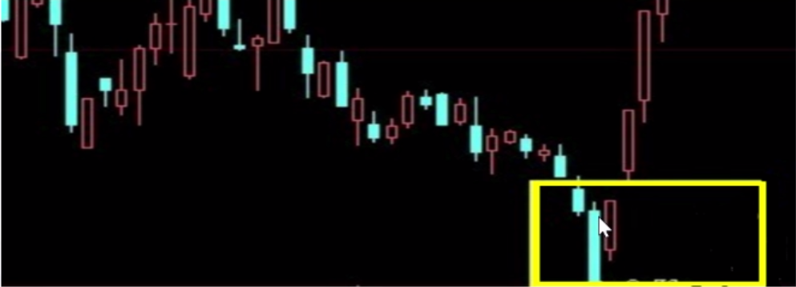
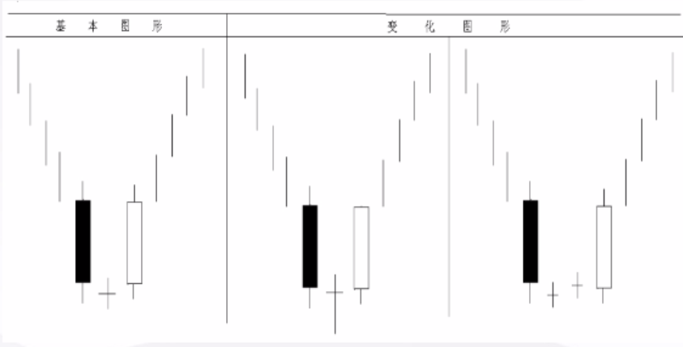
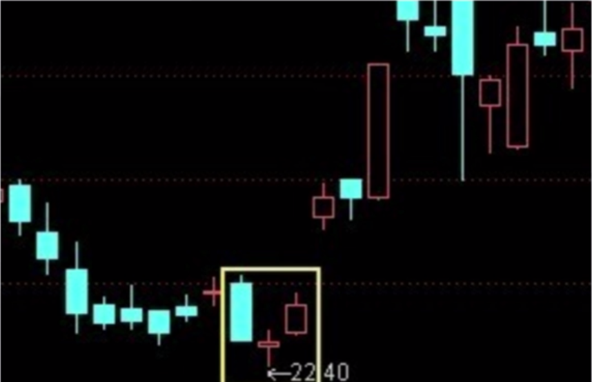

K 线的识别和联系
====================

# 一、K 线的概述

## K 线的定义
K 线又称阴阳线或阴阳烛。

它能将每个交易期间的开盘与收盘的涨跌以实体的阴阳线表示出来，并将交易曾初现的最高价及最低价以上影线和下影线形式直观的反映出来。如下图：

## K 线的分类
从形态上分为阳线、阴线和同价线。

## K 线的意义

### 单日 K 线
几种基本的 K 线形态：
- **大阳线（长红）**：开盘价接近于全日的最低价，随后价格一路上扬至最高价处收盘，表示市场买方踊跃，涨势未尽；

- **大阴线（长黑/长绿）**：开盘价接近于全日的最高价，随后价格一路下滑至最低价收盘，表示市场强烈跌势，特别是出现在高价区域，更加危险；

- **下影阳线**：价格一度大幅下滑，但受到买盘势力支持，价格又回升向上，收盘在最高价处，属强势形态；

- **下影阴线**：价格一度大幅下滑后但受到买盘势力支持，价格回升向上，虽然收盘价仍然低于开盘价，也可视为强势。但在高价区出现时，说明价格有回调要求，应注意卖出；

- **上影阳线**：价格冲高回落，涨势受阻，虽然收盘价仍高于开盘价，但上方有阻力，可视为弱势；

- **上影阴线**：价格冲高受阻，涨势受阻，收盘价低于开盘价，上方有阻力，可视为弱势；

- **下十字线**：开盘后价格大幅下滑，但在低位处获得支撑，下方买盘积极主动，最终在最高价附近收盘，属强势。当长下影线出现在低价区时，常常是重要的反转信号；

- **倒十字线**：价格冲高后在高位处遇到强大阻力，最终被迫在开盘价附近收盘。虽有上攻愿望，但市场有修整要求，弱势。当倒十字线出现在高价区时，常常是重要的变盘信号；

- **十字星**：买卖双方势均力敌，走势平稳；但在强势市中，十字星往往成为市场强弱转换的交叉点，后市可能变化；

- **一字线**：四价合一 K 线反映出市场成交清淡，后市难有大的变化；但如果出现在涨停（跌停）处，表明买卖双方力量悬殊太大，后市方向明确，短期难以逆转。

### K 线的组合
k 线的组合形态很多，其意义也不尽相同，应依据不同价格水平及其变动趋势来分析。

## 各周期 K 线级别的关系
- 1 个月 K 线 = 4 个周 K 线
- 1 个周 K 线 = 5 个日 K 线
- 1 个日 K 线 = 4 个小时 K 线
- 1 个小时 K 线 = 4 个 15 分钟 K 线

## K 线形态可分为：
- 上升形态和见底形态
- 下跌形态和滞涨形态
- 既是上升形态又是下跌形态

_* 见底不一定上涨，它只能说明股价跌不下去了。股价有可能经过一段时间筑底之后才能回升。_

# 曙光初现
属于上升形态和见底形态的 K 线组合，如下图：

 
 

## 特征
- 出现在下跌趋势；
- 由一阴一阳两根 K 线组成；
- 先是一根大阴线或中阴线，接着出现一根大阳线或中阳线，并且阳线实体深入阴线实体的 1/2 出以上。

## 技术含义
见底信号，后市看涨。

## 案例

_* 阳线实体深入阴线实体越多，转势信号越强。_

# 旭日东升
属于上升形态和见底形态的 K 线组合，如下图：

 
 

## 特征
- 出现在下跌趋势；
- 由一阴一阳两根 K 线组成；
- 先是一根大阴线或中阴线，接着出现一根高开的大阳线或中阳线，阳线实体的收盘价已高于前一根阴线的开盘价。

## 技术含义
见底信号，后市看涨。

## 案例

_见底信号强于曙光初现；阳线实体高出阴线实体越多，转势信号越强。_

# 早晨十字星
又称“希望十字星”，属于上升形态和见底形态的 K 线组合，如下图：

## 特征
- 出现在下跌趋势；
- 由 3 根 K 线组成，第 1 根是阴线，第 2 根是十字线，第 3 根是阳线。第 3 根 K 线实体深入到第 1 根 K 线实体之内。

## 技术含义
见底信号，后市看涨。

## 案例

# 相关链接 
- [01.散户如何建立交易体系](https://github.com/IamDingj/FinancialHub/blob/master/FBSHG/01.%E6%95%A3%E6%88%B7%E5%A6%82%E4%BD%95%E5%BB%BA%E7%AB%8B%E4%BA%A4%E6%98%93%E4%BD%93%E7%B3%BB.md)
- [03.节奏点](https://github.com/IamDingj/FinancialHub/blob/master/FBSHG/03.%E8%8A%82%E5%A5%8F%E7%82%B9.md)
- [04.技术指标](https://github.com/IamDingj/FinancialHub/blob/master/FBSHG/04.%E6%8A%80%E6%9C%AF%E6%8C%87%E6%A0%87.md)
- [05.资金管理](https://github.com/IamDingj/FinancialHub/blob/master/FBSHG/05.%E8%B5%84%E9%87%91%E7%AE%A1%E7%90%86.md)
- [06.富伯说股总结](https://github.com/IamDingj/FinancialHub/blob/master/FBSHG/06.%E5%AF%8C%E4%BC%AF%E8%AF%B4%E8%82%A1%E6%80%BB%E7%BB%93.md)

# 参考 
- [K 线图](https://baike.baidu.com/item/K%E7%BA%BF%E5%9B%BE/85028)