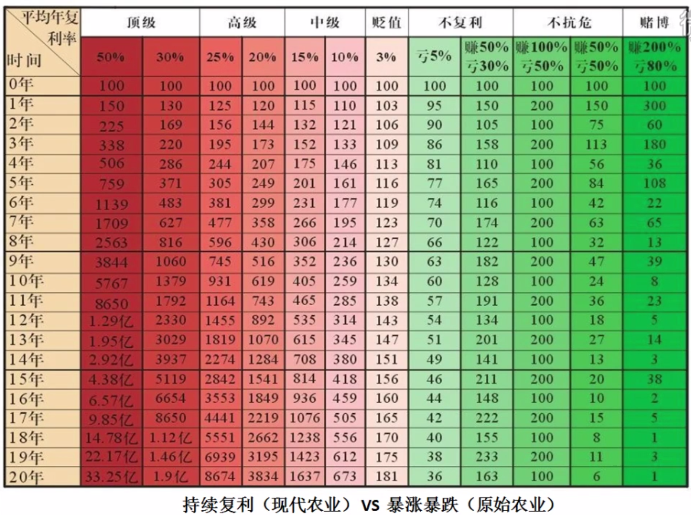
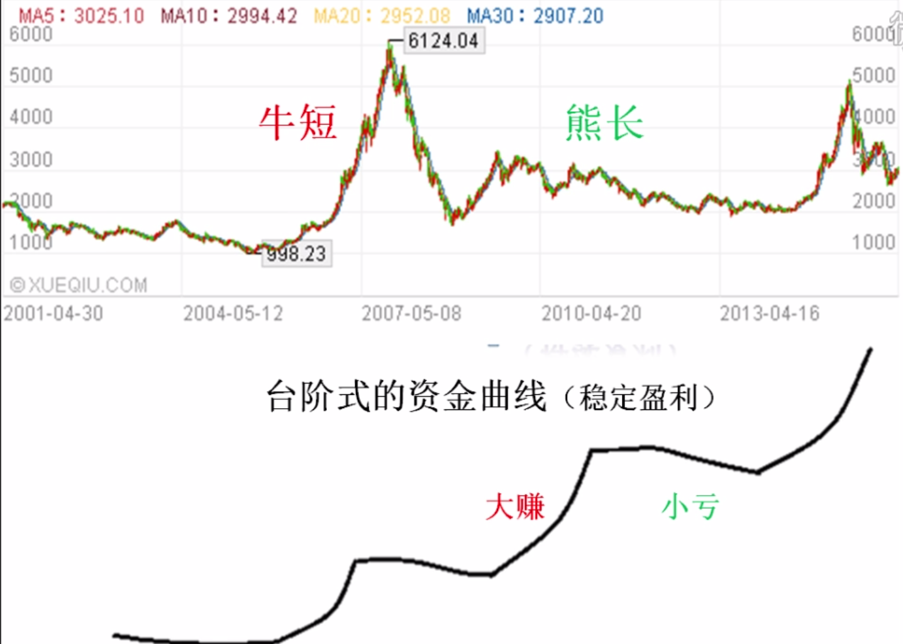

富伯交易系统揭秘
====================

# 一、富伯交易系统简介

 

_持续复利，不暴涨暴跌。_

 

_稳定盈利的资金曲线。_

持续复利需要具备的能力：
- 趋势判定
- 交易策略
- 盈利模式

## 趋势判定
- 牛市：周线大盘同时在红、黑线上方
- 熊市：周线大盘同时在红、黑线下方
- 震荡市：周线大盘在红、黑线之间

## 交易策略
顺势而为

### 资金管理
- 牛市：80% 以上
- 熊市：空仓、无风险收益品种（存银行、逆回购、抗熊市风险基金）
- 震荡市：

    - 牛市的震荡：50%
    - 熊市的震荡：20%

### 市道定手法
什么环境用什么样的盈利模式最有效。

## 盈利模式
- 选股：盈利模式
- 交易：买、卖、持仓、观望、加减仓

决策、执行、应变

交易系统的指定，一切围绕持续稳定盈利。

# 一、股市高手盈利的秘密

## 能持续盈利的高手他们是怎么想的，怎么盈利的

## 成为高手的路上有哪些绊脚石

## 找到正确的方向和方法
- 高位套牢、解套
- 技术指标的正确使用方法
- 支撑压力位的识别方法
- T+0 的方法
- 资金流向、大单
- 牛股怎么拿住，不坐过山车 

股市 7 赔 2 平 1 赚：
- 牛短熊长
- 股市规则（人的股市：明面规则/潜规则）
了解
    - 散户的对手有哪些：社保基金、共同基金、券商自营、保险资金、私募基金、QFII、热钱、散户

    对手的专业能力很强，并且洞察人心，而散户需要和这样的人博弈

技术分析：买卖点

# 参考 
- [K 线图](https://baike.baidu.com/item/K%E7%BA%BF%E5%9B%BE/85028)
