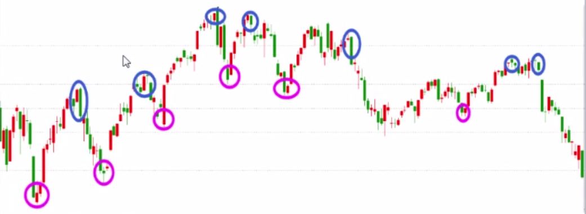
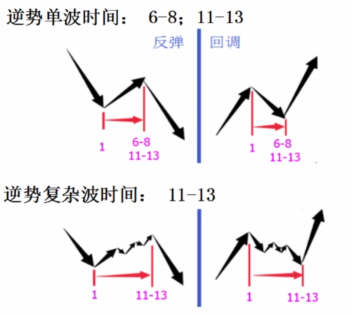
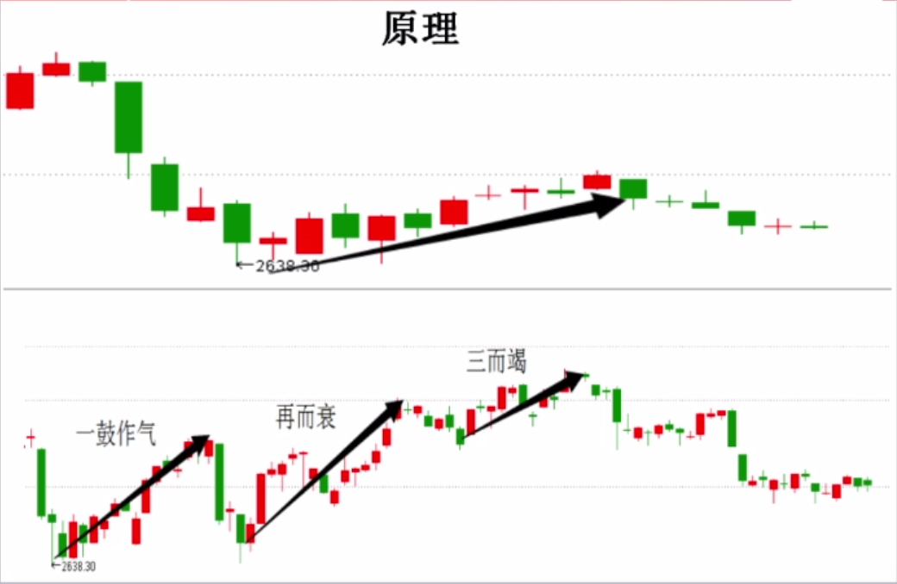

节奏点
====================

什么是节奏点？
- 涨跌转折
- 跌不动或涨不动的位置

 

节奏点的分类：
- 时间节奏
- 空间节奏
- 时空共振

# 一、时间节奏

## 概念
> 研究多空博弈，弱方逆势运动时间。

弱方逆势运动：牛市的空头、熊市的多头。

单波时间窗口：6 ~ 8 / 11 ~ 13

复杂波时间窗口：11 ~ 13

 

## 原理
多空博弈的**弱势心理**，很脆弱，有规律。

希望心理 -> 失望心理 -> 绝望心理

曹刿论战：一鼓作气 -> 再而衰 -> 三而竭

 

## 应用
适用于大盘、个股各个周期级别。

应用步骤：

1.先辨势，确定谁是弱势方（逆势波动）
- 上升趋势的回调
- 下跌趋势的反弹
- 震荡市的涨和跌

2.逆势的时间窗口 6 ~ 8 / 11 ~ 13

3.时间窗口临近，在低级别上找背离，占先机
- 下降趋势，反弹 6 ~ 8 之后不追高（卖点）
- 上升趋势，下跌 6 ~ 8 之后不割肉（买点）

## 注意事项

1.时间节奏不是预测，是规律。群体的心理既有规律性，又随环境变化。

2.时间节奏的使用，建立在顺势思维的基础上

- 死多空头，败在逆势
    - 熊市抄底：套牢
    - 牛市逃顶：踏空、做空爆仓 

- 玩震荡的，败在趋势里
    - 技术指标、时间周期，在一些震荡市有用，预测上瘾
    - 遇到单边市：套牢、踏空

# 二、空间节奏

去找一个支撑或压力的位置。

空间节奏的分类：
- **黄金分割**
- 股性波动率
- 第一次触及密集成交区 / 历史高、低点

## 概念
> 在黄金分割位置容易反弹或止跌。

## 原理
符合人类美感，自然规律，同样也适用于股市；从行为分析的角度看，认同的人多了，自然就有效。

## 应用
- 趋势改变后，寻找回调支撑或反弹的压力位 (0.382、0.618)
- 破位或突破后，寻找下跌支撑或上涨的目标位 (背离0.382、0.618)
- 共振：时间节奏、空间、背离、指标...
- 画法：用软件工具黄金分割，取两个点（最高和最低点）

## 注意事项

# 参考 
- [K 线图](https://baike.baidu.com/item/K%E7%BA%BF%E5%9B%BE/85028)
