节奏点
====================

什么是节奏点？
- 涨跌转折
- 跌不动或涨不动的位置

节奏点的分类：
- 时间节奏
- 空间节奏
- 时空共振

# 一、时间节奏

## 概念
> 研究多空博弈，弱方逆势运动时间。

弱方逆势运动：如牛市的空头、熊市的多头。

单波时间窗口：6 ~ 8 / 11 ~ 13

复杂波时间窗口：11 ~ 13

## 原理
多空博弈的**弱势心理**，很脆弱，有规律。

希望心理 -> 失望心理 -> 绝望心理

曹刿论战：一鼓作气 -> 再而衰 -> 三而竭

## 应用
适用于大盘、个股的各个周期级别。

应用步骤：

1.先辨势，确定谁是弱势方（逆势波动）
- 上升趋势的回调
- 下跌趋势的反弹
- 震荡市的涨和跌

2.逆势的时间窗口 6 ~ 8 / 11 ~ 13

3.时间窗口临近，在低级别上找背离，占先机
- 下降趋势，反弹 6 ~ 8 之后不追高（卖点）
- 上升趋势，下跌 6 ~ 8 之后不割肉（买点）

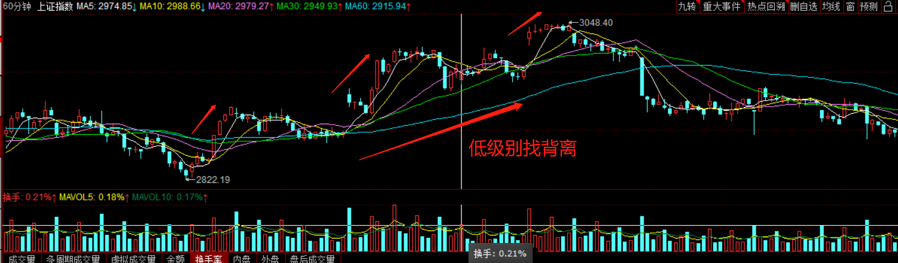

## 注意事项

1.时间节奏不是预测，是规律。群体的心理既有规律性，又随环境变化。

2.时间节奏的使用，建立在顺势思维的基础上

- 死多空头，败在逆势
    - 熊市抄底：套牢
    - 牛市逃顶：踏空、做空爆仓 

- 玩震荡的，败在趋势里
    - 技术指标、时间周期，在一些震荡市有用，预测上瘾
    - 遇到单边市：套牢、踏空

# 二、空间节奏 - 黄金分割

找一个支撑或压力的位置。

空间节奏的分类：
- **黄金分割**
- 股性波动率
- 支撑位、压力位

## 概念
> 在黄金分割位置容易反弹或止跌。

## 原理
符合人类美感，自然规律，同样也适用于股市；从行为分析的角度看，认同的人多了，自然就有效。

## 应用
适用于大盘、个股的各个周期级别。

- 趋势改变后，寻找(上升)**回调支撑位**或(下降)**反弹的压力位** (38.2%、61.8%)

- 破位或突破后，寻找下跌支撑或上涨的目标位(背离：38.2%、61.8%)

- 共振：时间节奏、空间、背离、指标...

画图：用软件工具（如：通达信）黄金分割，取两个点（最高和最低点）

通信达 -> 工具 -> 画图工具

## 注意事项
- 黄金分割使用级别越大，准确性往往越高；
- 与其他方法共振，准确性更高；
- 不是预测买入的价格，是观察买入节奏的区域；
- 当价格在黄金分割位，进入加速状态时，贪婪与恐惧的情绪会放大，一定要克服。

# 三、空间节奏 - 压力位、支撑位

## 股市运行两大规律的核心：
- 趋势方向（顺势而为）
- 支撑与压力

## 支撑与压力
- 支撑：是指价格回落中形成的低点，他是由于多方在此买入形成。
- 压力：是指价格上涨中形成的高点，他是由于空方在此卖出形成。

## 支撑与阻力的相互转换
价格在前期的高点和低点附近都是关键的敏感区域，前期高点都是阻挡，前期低点都是支撑，一旦价格突破前期高点，此高点由阻力位变成支撑位，一旦价格跌破前期支撑，此低点由支撑变为阻力。

在确认支撑与阻力的角色转换时，反方突破越深，保持的时间越久，被确认的可靠性就越大。

## 支撑与压力的作用与意义
- 价格暂时被阻止向原有趋势方向运动时，一旦后期被成功收复，趋势将继续按原方向运行。
- 价格无力收复原有失地，被彻底阻止向原有趋势方向运动时，就有可能构成趋势的反转。
- 上升趋势中支撑起主导作用，只有**关键压力位**才有可能决定趋势的反转。
- 下降趋势中阻力起主导作用，只有**关键支撑位**才能对趋势的变化起重要作用。

## 支撑线和压力线的识别
- 看成交量（成交量越大越有效，小心压力位放量）
- 看持续时间（维持原有时间越长越有效）
- 看次数（次数越多越有效）
- 看远近（时间越近越有效）

## 常见的支撑与阻力
- 1、近阶段新高新低位置（可根据黄金分割线找出）
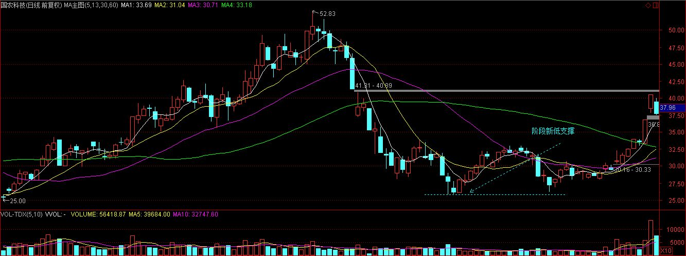
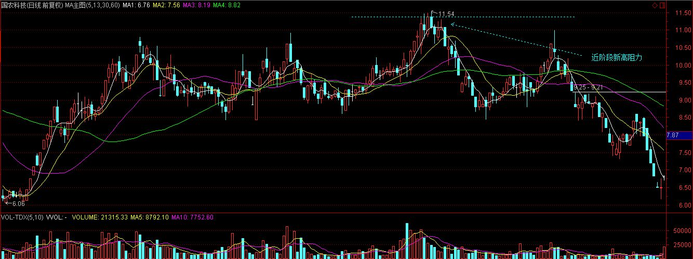

- 2、密集成交区域
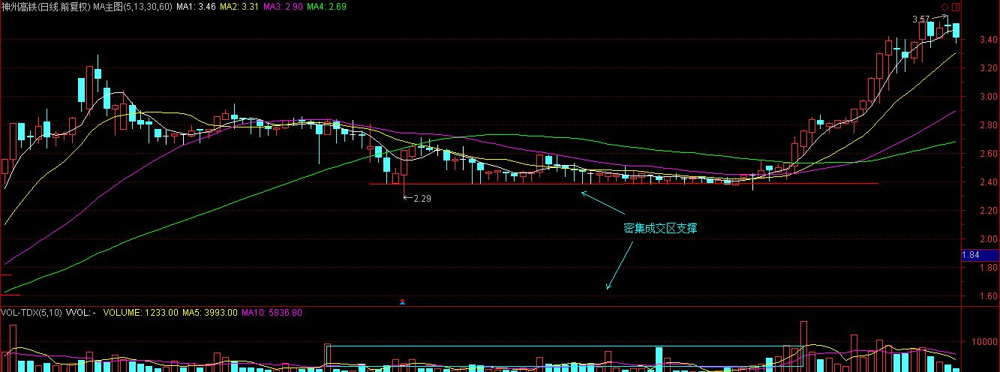
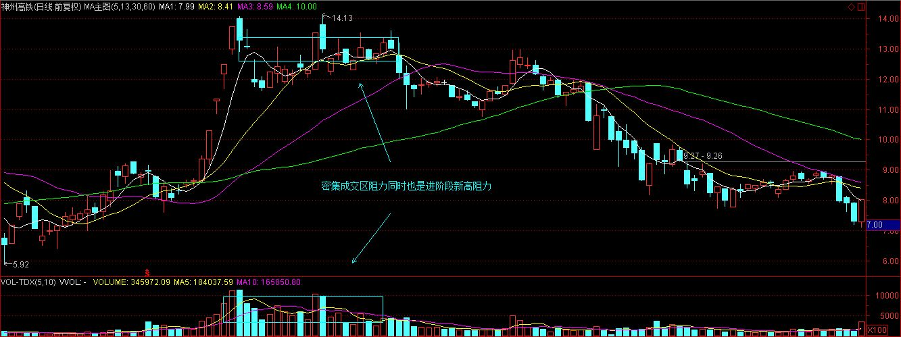

- 3、重要的整数关口。关口位置本身没有作用，但是在经过市场反复确认后，可能会在某个位置形成很强的支撑或阻力作用，比如近段时间创业板的1900点关口就是阻力位。

- 4、跳空缺口形成的支撑或阻力
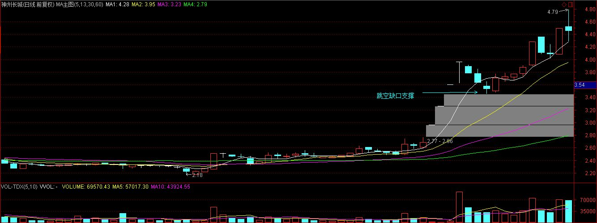
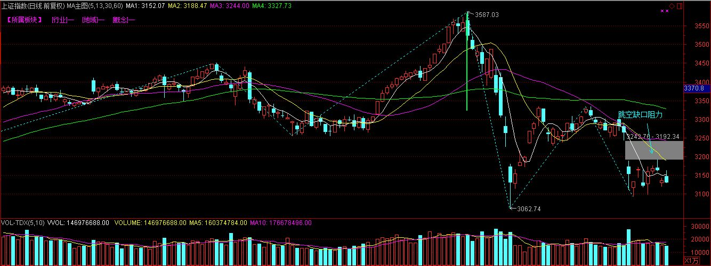

- 5、股价多次触及的位置形成的支撑和阻力
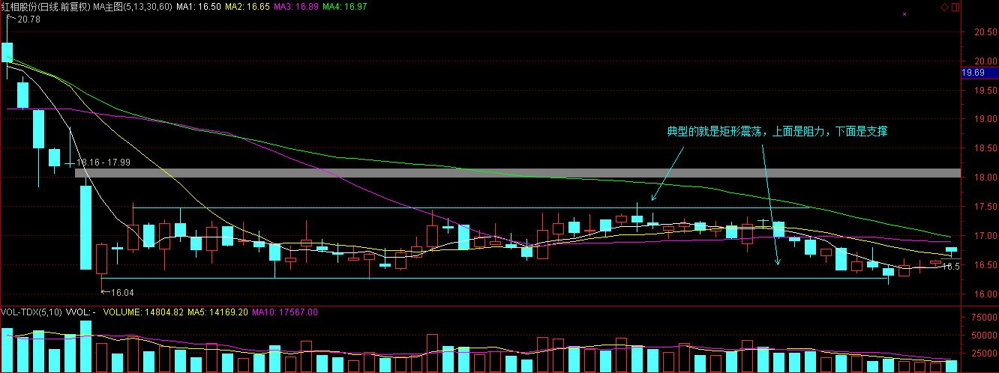

- 6、趋势线具有支撑或阻力作用
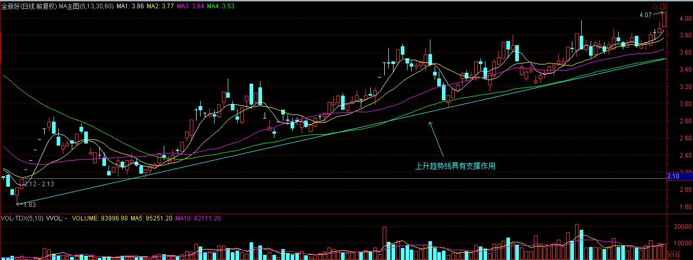
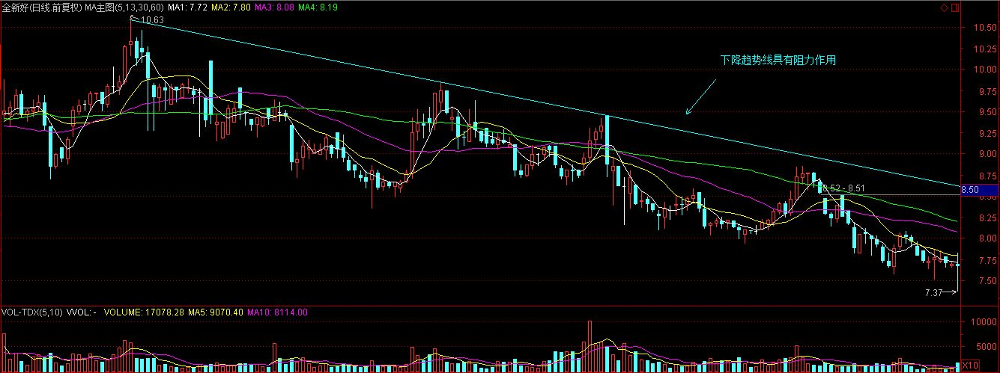

- 7、各种技术形态的颈线具有支撑或阻力作用。比如头肩形，三角形，旗形等，它们的颈线位具有支撑或阻力的作用。 

## 支撑与阻力的买卖策略
- 1、上升趋势中的买卖时机
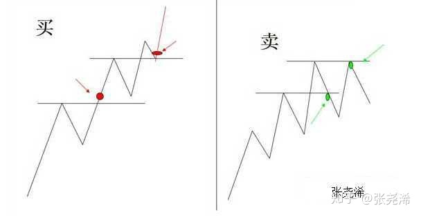

- 2、下降趋势中的买卖时机
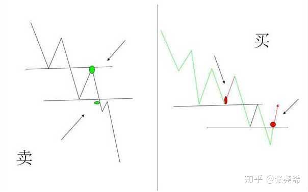

- 3、支撑与压力的操作策略
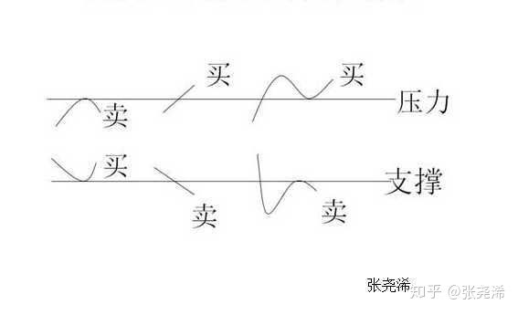

- 4.上涨到压力区间时，出现放量上涨，卖点（庄家出货，散户进场）

- 5.下降到支撑区间时，出现放量下跌，买点

## 支撑和压力形成的条件：
- 前期快速大涨的行情突然出现大幅回落，前期快速大跌的行情突然出现大幅反弹。预示行情可能进入震荡区间；
- 当经历一波大牛市或大熊市之后行情进入小趋势后容易形成震荡区间。

股市 70% 的时间都是震荡式，合理的运用支撑位和压力位也能带来不错的收益。

# 四、时空共振
结合时间和空间节奏来分析、判断更为准确。

# 相关链接
- [01.散户如何建立交易体系](https://github.com/IamDingj/FinancialHub/blob/master/FBSHG/01.%E6%95%A3%E6%88%B7%E5%A6%82%E4%BD%95%E5%BB%BA%E7%AB%8B%E4%BA%A4%E6%98%93%E4%BD%93%E7%B3%BB.md)
- [02.K 线的识别和联系](https://github.com/IamDingj/FinancialHub/blob/master/FBSHG/02.K%E7%BA%BF%E7%9A%84%E8%AF%86%E5%88%AB%E5%92%8C%E8%81%94%E7%B3%BB.md)
- [04.技术指标](https://github.com/IamDingj/FinancialHub/blob/master/FBSHG/04.%E6%8A%80%E6%9C%AF%E6%8C%87%E6%A0%87.md)
- [05.资金管理](https://github.com/IamDingj/FinancialHub/blob/master/FBSHG/05.%E8%B5%84%E9%87%91%E7%AE%A1%E7%90%86.md)
- [06.富伯说股总结](https://github.com/IamDingj/FinancialHub/blob/master/FBSHG/06.%E5%AF%8C%E4%BC%AF%E8%AF%B4%E8%82%A1%E6%80%BB%E7%BB%93.md)

# 参考 
- [如何找支撑位和压力位](https://www.zhihu.com/question/337290434/answer/771411880)
- [教你技术分析（一）——支撑与阻力](https://zhuanlan.zhihu.com/p/35489068)

