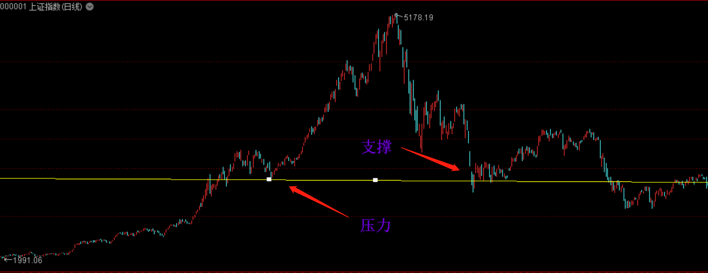

节奏点
====================

什么是节奏点？
- 涨跌转折
- 跌不动或涨不动的位置

节奏点的分类：
- 时间节奏
- 空间节奏
- 时空共振

# 一、时间节奏

## 概念
> 研究多空博弈，弱方逆势运动时间。

弱方逆势运动：如牛市的空头、熊市的多头。

单波时间窗口：6 ~ 8 / 11 ~ 13

复杂波时间窗口：11 ~ 13

## 原理
多空博弈的**弱势心理**，很脆弱，有规律。

希望心理 -> 失望心理 -> 绝望心理

曹刿论战：一鼓作气 -> 再而衰 -> 三而竭

## 应用
适用于大盘、个股的各个周期级别。

应用步骤：

1.先辨势，确定谁是弱势方（逆势波动）
- 上升趋势的回调
- 下跌趋势的反弹
- 震荡市的涨和跌

2.逆势的时间窗口 6 ~ 8 / 11 ~ 13

3.时间窗口临近，在低级别上找背离，占先机
- 下降趋势，反弹 6 ~ 8 之后不追高（卖点）
- 上升趋势，下跌 6 ~ 8 之后不割肉（买点）

## 注意事项

1.时间节奏不是预测，是规律。群体的心理既有规律性，又随环境变化。

2.时间节奏的使用，建立在顺势思维的基础上

- 死多空头，败在逆势
    - 熊市抄底：套牢
    - 牛市逃顶：踏空、做空爆仓 

- 玩震荡的，败在趋势里
    - 技术指标、时间周期，在一些震荡市有用，预测上瘾
    - 遇到单边市：套牢、踏空

# 二、空间节奏 - 黄金分割

去找一个支撑或压力的位置。

空间节奏的分类：
- **黄金分割**
- 股性波动率
- 支撑位、压力位

## 概念
> 在黄金分割位置容易反弹或止跌。

## 原理
符合人类美感，自然规律，同样也适用于股市；从行为分析的角度看，认同的人多了，自然就有效。

## 应用
适用于大盘、个股的各个周期级别。

- 趋势改变后，寻找(上升)**回调支撑位**或(下降)**反弹的压力位** (0.382、0.618)

- 破位或突破后，寻找下跌支撑或上涨的目标位(1.382、1.618)

- 共振：时间节奏、空间、背离、指标...

画图：用软件工具（通达信）黄金分割，取两个点（最高和最低点）

通信达 -> 工具 -> 画图工具

## 注意事项

# 三、空间节奏 - 压力位、支撑位

股市运行两大规律的核心：
- 趋势方向
- 压力、支撑

**压力位**：当股价上涨到某价位附近时，股价会停止上涨，甚至回落。这个起着阻止或暂时阻止股价继续上升的价位就是**压力线**所在的位置。

**支撑位**：当股价跌到某个价位附近时，股价停止下跌，甚至有可能还有回升。这个起着阻止股价继续下跌或暂时阻止股价继续下跌的价格就是**支撑线**所在的位置。

在股价运行时，压力与支撑是可以互换的，具体地说，如果重大的压力位被有效突破，那么该压力位则反过来变成未来重要的支撑位；反之，如果重要的支撑位被有效击穿，则该价位反而变成今后股价上涨的压力位了。

压力位和支撑位一般有几种情况：
- 均线压力位和支撑位；
- 高点和低点的压力位和支撑位；
- 跳空缺口的压力位和支撑位。

支撑线和压力线的确认：
- 看成交量（线上交易量越大越有效）
- 看持续时间（维持原有时间越长越有效）
- 看次数（次数越多越有效）
- 看远近（时间越近越有效）
 
支撑和压力形成的条件：
- 前期快速大涨的行情突然出现大幅回落，前期快速大跌的行情突然出现大幅反弹。预示行情可能进入震荡区间；
- 当经历一波大牛市或大熊市之后行情进入小趋势后容易形成震荡区间。

股市 70% 的时间都是震荡式，合理的运用支撑位和压力位也能带来不错的收益。

# 四、时空共振

结合时间和空间节奏来分析、判断更为准确。

# 相关链接
- [01.散户如何建立交易体系](https://github.com/IamDingj/FinancialHub/blob/master/FBSHG/01.%E6%95%A3%E6%88%B7%E5%A6%82%E4%BD%95%E5%BB%BA%E7%AB%8B%E4%BA%A4%E6%98%93%E4%BD%93%E7%B3%BB.md)
- [02.K 线的识别和联系](https://github.com/IamDingj/FinancialHub/blob/master/FBSHG/02.K%20%E7%BA%BF%E7%9A%84%E8%AF%86%E5%88%AB%E5%92%8C%E8%81%94%E7%B3%BB.md)
- [04.技术指标](https://github.com/IamDingj/FinancialHub/blob/master/FBSHG/04.%E6%8A%80%E6%9C%AF%E6%8C%87%E6%A0%87.md)
- [05.资金管理](https://github.com/IamDingj/FinancialHub/blob/master/FBSHG/05.%E8%B5%84%E9%87%91%E7%AE%A1%E7%90%86.md)
- [06.富伯说股总结](https://github.com/IamDingj/FinancialHub/blob/master/FBSHG/06.%E5%AF%8C%E4%BC%AF%E8%AF%B4%E8%82%A1%E6%80%BB%E7%BB%93.md)

# 参考 
- [百度百科-压力位](https://baike.baidu.com/item/%E5%8E%8B%E5%8A%9B%E4%BD%8D)
- [百度百科-支撑位](https://baike.baidu.com/item/%E6%94%AF%E6%92%91%E4%BD%8D)
