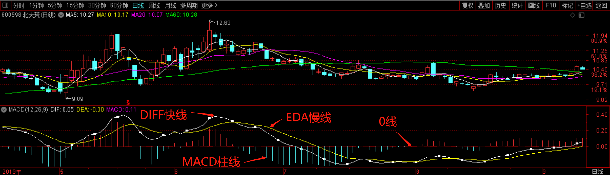
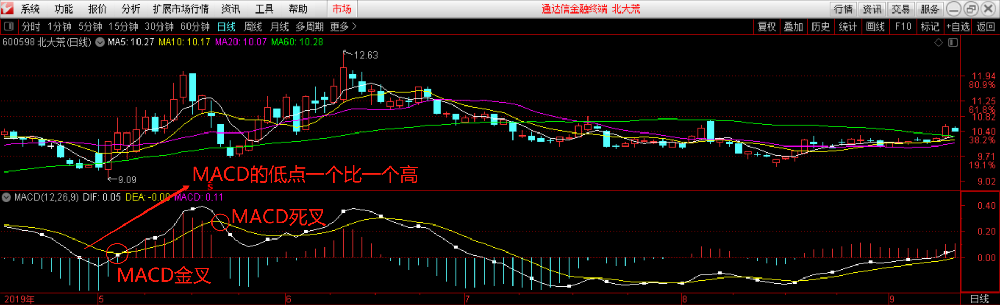

技术指标
====================

# 均线
> 均线（MA），将某一段时间的收盘价之和除以该周期。如：MA5 指最近5个交易日收盘价的均价，即为当天的5日均线。

均线分为短期、中期、长期均线：
- 短期：常用 MA5、MA10
- 中期：常用 MA20、MA30、MA60
- 长期：常用 MA120、MA250

若 3 条移动均线并列上涨，则市场呈多头排列；若 3 中移动均线并列下跌，则市场呈空头排列。

_空头指的是一种交易方式，有些投资者对自己当前持有的股票前景不看好，认为股价目前处在相对高位上，从而卖出股票。而当股票下跌到一定低点之后又买进股票，从而赚取高低之间的差价，这种交易方式被称为**空头**。因此，当股票市场处在下跌趋势的时候，被称为空头市场。_

_多头跟空头正好相反，当大多数投资者对股市前景看好，认为股价还有一定的上涨空间，从而继续持有股票或者买入或者加仓，这种交易方式被称为**多头**。因此，当股票处在上升趋势的时候，被为多头市场。_
  
_在股市中，股价的上涨或下跌是有多头和空头博弈的结果，当多头力量占优，股价就会上升，当空头力量占优，股价就会下跌。但是，多头和空头并不是一直保持不变的，很多时候他们之间是相互转变的，当多头不看好当前市场的时候，就会转变为空头，而空头看好当前市场的时候，也会转变为多头。_

## 均线的应用
- 葛兰比均线 8 大法则
- 衍生均线 expma、ema (使用指标时注意未来函数)
- 修改“神秘”参数（股市一大谎言）

均线来自于价格，不同股票价格的波动率不同；因此，没有一组均线适用于所有股票。

## 主力均线
在具体的 K 线走势中，经常会发现一条均线，上升趋势时托住 K 线上行；下跌趋势时一直压制 K 线向下运行，假如 K 线突破这条均线，通常后续会出现一个级别较大的调整或趋势开始转向。

主力均线的用法：
- 顺势
    - 寻找趋势分析
    - 大的转折一般是从第三个底开始
    - 主力均线不是对过去负责，而是预判未来转势。
- 节奏
    - 预判调整周期：主力均线 N*2/3 (如：主力均线30->30*2/3=20，调整时间为20个交易日)

# MACD 指标
MACD 指标，即指数平滑异同移动平均线指标。用来跟踪股价运行趋势、研判股票买卖时机的技术分析工具。

MACD 指标由 DIFF 快线、DEA 慢线、MACD 柱线和零轴这“三线一轴”组成。通过“三线一轴”的交叉、背离、突破、支撑与阻碍等方式来对股价进行研判。

## 趋势识别

_股价上涨过程中，MACD 随着股价的震荡逐步走高。_

顺势操作是所有投资者的共同理念。MACD 指标中两条曲线每次交叉与位置互换，MACD 指标与股价、指数的背离，都有可能形成股价运动趋势的转向，即由上涨转为下跌趋势，或由下跌转为上涨趋势。不过这种趋势有时属于短期、有时属于长期运行趋势的变化。

通常情况下，出现下列情况，意味着股价处于或即将进入上涨趋势：

- MACD 在 0 轴上方出现黄金交叉，其后 DIFF 快线一直位于 DEA 慢线上方；
- MACD 低位出现底背离，即股价连续创新低，而 MACD 低点却一个比一个高；
- MACD 的两条曲线向右上方倾斜，且 MACD 柱线越来越长，回调时低点一个比一个高；

当股价处于下跌趋势时，MACD 表现出来的特征与上述情形刚好相反。

## 理解
MACD 指标的构造过程，对投资者可以从以下几个方面理解：

- MACD 和均线的关系：MACD 来源于 EMA，所以具有均线指标稳定、能追踪趋势的特点，可以对市场动能做出客观的反应。与此同时，MACD 去掉了均线有时频发出假信号的缺陷，使得 MACD 指标在对中长期趋势的把握上准确率较高；

- MACD 是市场动能最直接的反应：MACD 实际上是围绕两个离差值进行分析，一个是 DIFF(快慢均线的差值，可理解为股价上涨或下跌的速度)，另一个是 MACD 柱线(快慢 DIFF 的差值，可理解为股价上涨或下跌的加速度)；

- MACD 指标的滞后性：MACD 主要反应市场中长期趋势，对股价短期的反应较为滞后，远不如 K 线及时；

- MACD 不适合短线、超短线投资者使用。

# 相关链接
- [01.散户如何建立交易体系](https://github.com/IamDingj/FinancialHub/blob/master/FBSHG/01.%E6%95%A3%E6%88%B7%E5%A6%82%E4%BD%95%E5%BB%BA%E7%AB%8B%E4%BA%A4%E6%98%93%E4%BD%93%E7%B3%BB.md)
- [02.K 线的识别和联系](https://github.com/IamDingj/FinancialHub/blob/master/FBSHG/02.K%20%E7%BA%BF%E7%9A%84%E8%AF%86%E5%88%AB%E5%92%8C%E8%81%94%E7%B3%BB.md)
- [03.节奏点](https://github.com/IamDingj/FinancialHub/blob/master/FBSHG/03.%E8%8A%82%E5%A5%8F%E7%82%B9.md)
- [05.资金管理](https://github.com/IamDingj/FinancialHub/blob/master/FBSHG/05.%E8%B5%84%E9%87%91%E7%AE%A1%E7%90%86.md)
- [06.富伯说股总结](https://github.com/IamDingj/FinancialHub/blob/master/FBSHG/06.%E5%AF%8C%E4%BC%AF%E8%AF%B4%E8%82%A1%E6%80%BB%E7%BB%93.md)
 
# 参考  
- [767股票学习网-MACD指标介绍](http://www.net767.com/book/macdrumen/201608/22095.html)
