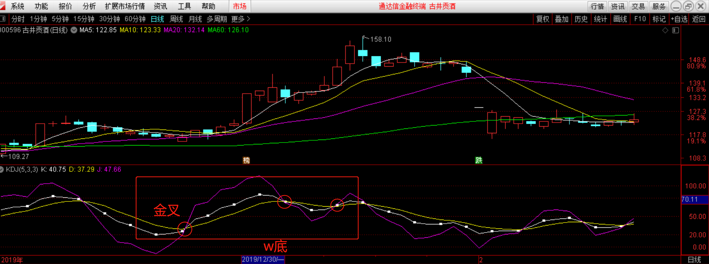
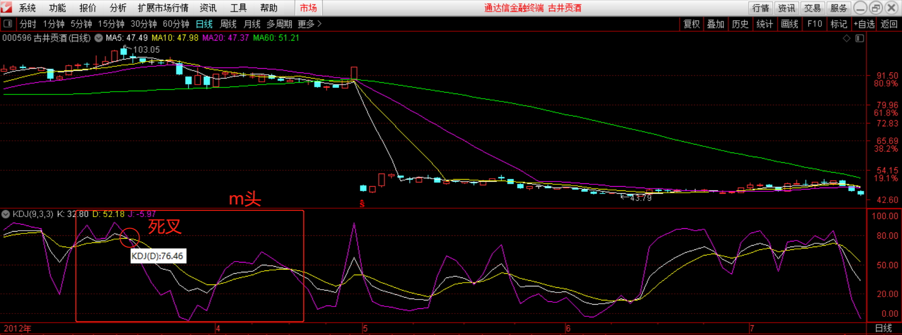

技术指标
====================

# 均线
> 均线（MA），将某一段时间的收盘价之和除以该周期。如：MA5 指最近5个交易日收盘价的均价，即为当天的5日均线。

均线分为短期、中期、长期均线：
- 短期：常用 MA5、MA10
- 中期：常用 MA20、MA30、MA60
- 长期：常用 MA120、MA250

若 3 条移动均线并列上涨，则市场呈多头排列；若 3 中移动均线并列下跌，则市场呈空头排列。

_空头指的是一种交易方式，有些投资者对自己当前持有的股票前景不看好，认为股价目前处在相对高位上，从而卖出股票。而当股票下跌到一定低点之后又买进股票，从而赚取高低之间的差价，这种交易方式被称为**空头**。因此，当股票市场处在下跌趋势的时候，被称为空头市场。_

_多头跟空头正好相反，当大多数投资者对股市前景看好，认为股价还有一定的上涨空间，从而继续持有股票或者买入或者加仓，这种交易方式被称为**多头**。因此，当股票处在上升趋势的时候，被为多头市场。_
  
_在股市中，股价的上涨或下跌是有多头和空头博弈的结果，当多头力量占优，股价就会上升，当空头力量占优，股价就会下跌。但是，多头和空头并不是一直保持不变的，很多时候他们之间是相互转变的，当多头不看好当前市场的时候，就会转变为空头，而空头看好当前市场的时候，也会转变为多头。_

## 均线的应用
- 葛兰比均线 8 大法则
- 衍生均线 expma、ema (使用指标时注意未来函数)
- 修改“神秘”参数（股市一大谎言）

均线来自于价格，不同股票价格的波动率不同；因此，没有一组均线适用于所有股票。

## 主力均线
在具体的 K 线走势中，经常会发现一条均线，上升趋势时托住 K 线上行；下跌趋势时一直压制 K 线向下运行，假如 K 线突破这条均线，通常后续会出现一个级别较大的调整或趋势开始转向。

 

主力均线的用法：
- 顺势
    - 寻找趋势分析
    - 大的转折一般是从第三个底开始
    - 主力均线不是对过去负责，而是预判未来转势。
- 节奏
    - 预判调整周期：主力均线 N*2/3 (如：主力均线30->30*2/3=20，调整时间为20个交易日)

# MACD 指标
MACD 指标，即指数平滑异同移动平均线指标。用来跟踪股价运行趋势、研判股票买卖时机的技术分析工具。

 

MACD 指标由 DIFF 快线、DEA 慢线、MACD 柱线和零轴这“三线一轴”组成。通过“三线一轴”的交叉、背离、突破、支撑与阻碍等方式来对股价进行研判。

## 趋势识别

 

_股价上涨过程中，MACD 随着股价的震荡逐步走高。_

顺势操作是所有投资者的共同理念。MACD 指标中两条曲线每次交叉与位置互换，MACD 指标与股价、指数的背离，都有可能形成股价运动趋势的转向，即由上涨转为下跌趋势，或由下跌转为上涨趋势。不过这种趋势有时属于短期、有时属于长期运行趋势的变化。

通常情况下，出现下列情况，意味着股价处于或即将进入上涨趋势：

- MACD 在 0 轴上方出现黄金交叉，其后 DIFF 快线一直位于 DEA 慢线上方；
- MACD 低位出现底背离，即股价连续创新低，而 MACD 低点却一个比一个高；
- MACD 的两条曲线向右上方倾斜，且 MACD 柱线越来越长，回调时低点一个比一个高；

当股价处于下跌趋势时，MACD 表现出来的特征与上述情形刚好相反。

## 理解
MACD 指标的构造过程，对投资者可以从以下几个方面理解：

- MACD 和均线的关系：MACD 来源于 EMA，所以具有均线指标稳定、能追踪趋势的特点，可以对市场动能做出客观的反应。与此同时，MACD 去掉了均线有时频发出假信号的缺陷，使得 MACD 指标在对中长期趋势的把握上准确率较高；

- MACD 是市场动能最直接的反应：MACD 实际上是围绕两个离差值进行分析，一个是 DIFF(快慢均线的差值，可理解为股价上涨或下跌的速度)，另一个是 MACD 柱线(快慢 DIFF 的差值，可理解为股价上涨或下跌的加速度)；

- MACD 指标的滞后性：MACD 主要反应市场中长期趋势，对股价短期的反应较为滞后，远不如 K 线及时；

- MACD 不适合短线、超短线投资者使用。

# KDJ 指标
KDJ 指标（随机摆动指标）是一种摆动类指标。

KDJ 指标并不用于分析趋势的运行状态,而主要用于分析市场**短期**内的**超买超卖**情况,从而指导投资者进行**短线的高抛低吸**操作。在盘整震荡走势中,它是短线高抛低吸操作中最得力的工具之一。

## 设计原理
KDJ 指标主要是以“平衡位置”为理论核心,通过观察价格在短期内脱离“平衡位置”的程度,从而明确市场短期内的超买超卖情况,以此作为研判价格波动的依据。

对于摆动类指标来说,它的基本原理就是**捕捉整理行情,一定幅度（强度）的上涨就是卖出的理由,一定幅度（强度）的下跌就是买入的理由**。在股票行情软件中的 KDJ 指标窗口中,无论行情是上升还是下降或是平台震荡,KDJ 指标窗口的三条指标线（K线、D线、J线）总是在一个相对平衡的位置两侧来回地波动,它的这一形态,正反映了 KDJ 指标的核心,价格的任何波动都将向其“平衡位置”回归。

KDJ指标在计算中主要是研究最高价、最低价与收盘价之间的关系,通过一段时期内出现过的最高价、最低价及当日收盘价来计算出 K 值和 D 值。在分析中通过将K值连成快速的 K 线、将 D 值连成慢速的 D 线,以此来进行共同研判,另外又引入了考查二者位置关系的 J 线。

## 指标分析

- KD 指标的背离。在 KD 处在高位或低位，如果出现与股价走向的背离，则是采取行动的信号;

- J 指标取值超过 100 和低于 0，都属于价格的非正常区域，大于 100 为超买，小 0 为超卖；

- KD 的取值。KD 的统一取值范围是 0～100，我们可以将其划分为 3 个区域：80 以上为超买区，20 以下为超卖区，其余为徘徊区。但是这里股票投资者需要注意的是这种划分只是一个信号提示，不能完全按这种分析的方法进行操作；

- KD 指标的交叉。K 与 D 的关系就如同股价与 MA 的关系一样，也有死亡交叉和黄金交叉的问题；

- KD 指标曲线的形态。当 KD 指标在较高或较低的位置形成了头肩形和多重顶(底)时，是采取行动的信号。这里股票投资者同样需要注意的是，这些形态一定要在较高位置或较低位置出现，位置越高或越低，结论越可靠。

## 实战应用
KDJ 常用的默认参数是 9，就我个人的使用经验而言，短线可以将参数改为 5，不但反应更加敏捷迅速准确，而且可以降低钝化现象，一般常用的 KDJ 参数有 5，9，19，36，45，73等。

### 实战研判
1).K 线是快速确认线——数值在 90 以上为超买，数值在 10 以下为超卖；

D 线是慢速主干线——数值在 80 以上为超买，数值在 20 以下为超卖；

J 线为方向敏感线，当 J 值大于 90，特别是连续 5 天以上，股价至少会形成短期头部，反之 J 值小于 10 时，特别是连续数天以上，股价至少会形成短期底部。

2).当 K 值由较小逐渐大于 D 值，在图形上显示 K 线从下方上穿 D 线，所以在图形上K线向上突破 D 线时，俗称**金叉**，即为买进的讯号。

实战时当 K，D 线在 20 以下交叉向上，此时的短期买入的信号较为准确；如果 K 值在 50 以下，由下往上接连两次上穿 D 值，形成右底比左底高的“W底”形态时，后市股价可能会有相当的涨幅。如下图：

 

3).当 K 值由较大逐渐小于 D 值，在图形上显示 K 线从上方下穿 D 线，显示趋势是向下的，所以在图形上 K 线向下突破 D 线时，俗称**死叉**，即为卖出的讯号。

实战时当 K，D 线在 80 以上交叉向下，此时的短期卖出的信号较为准确；如果 K 值在 50 以上，由上往下接连两次下穿 D 值，形成右头比左头低的“M头”形态时，后市股价可能会有相当的跌幅。如下图：

 

4).通过 KDJ 与股价背离的走势，判断股价顶底也是颇为实用的方法：
- A) 股价创新高，而 KD 值没有创新高，为顶背离，应卖出； 
- B) 股价创新低，而 KD 值没有创新低，为底背离，应买入；

需要注意的是KDJ顶底背离判定的方法，只能和前一波高低点时KD值相比，不能跳过去相比较。

## 应用
1) 在实际操作中，一些做短平快的短线客常用分钟指标，来判断后市决定买卖时机，在 T+0 时代常用 15 分钟和 30 分钟 KDJ 指标，在 T+1 时代多用 30 分钟和 60 分钟 KDJ 来指导进出。几条经验规律总结如下：

- 如果 30 分钟 KDJ 在 20 以下盘整较长时间，60 分钟 KDJ 也是如此，则一旦 30 分钟 K 值上穿 D 值并越过 20，可能引发一轮持续在 2 天以上的反弹行情；若日线 KDJ 指标也在低位发生交叉，则可能是一轮中级行情。但需注意 K 值与 D 值金叉后只有 K 值大于 D 值 20% 以上，这种交叉才有效；

- 如果 30 分钟 KDJ 在 80 以上向下掉头，K 值下穿 D 值并跌破 80，而60 分钟 KDJ 才刚刚越过 20 不到 50，则说明行情会出现回档，30 分钟 KDJ 探底后，可能继续向上；

- 如果 30 分钟和 60 分钟 KDJ 在 80 以上，盘整较长时间后 K 值同时向下交叉 D 值，则表明要开始至少 2 天的下跌调整行情；

- 如果 30 分钟 KDJ 跌至 20 以下掉头向上，而 60 分钟 KDJ 还在 50 以上，则要观察 60 分钟K值是否会有效穿过 D 值（K 值大于 D 值 20%），若有效表明将开始一轮新的上攻；若无效则表明仅是下跌过程中的反弹，反弹过后仍要继续下跌；

- 如果 30 分钟 KDJ 在 50 之前止跌，而 60 分钟 KDJ 才刚刚向上交叉，说明行情可能会再持续向上，仅属于回档

- 30 分钟或 60 分钟 KDJ 出现背离现象，也可作为研判大市顶底的依据，详见前面日线背离的论述；

- 在超强市场中，30分钟KDJ可以达到90以上，而且在高位屡次发生无效交叉，此时重点看60分钟KDJ，当60分钟KDJ出现向下交叉时，可能引发短线较深的回档；

- 在暴跌过程中 30 分钟 KDJ 可以接近 0 值，而大势依然跌势不止，此时也应看 60 分钟 KDJ，当 60 分钟 KDJ 向上发生有效交叉时，会引发极强的反弹。

2) 当行情处在极强极弱单边市场中，日 KDJ 出现屡屡钝化，应改用 MACD 等中长指标；当股价短期波动剧烈，日 KDJ 反应滞后，应改用 CCI，ROC 等指标；或是使用 SLOWKD 慢速指标；

3) KDJ 在周线中参数一般用 5，周 KDJ 指标见底和见顶有明显的提示作用，据此波段操作可以免去许多辛劳，争取利润最大化，需提示的是一般周 J值在超卖区 V 形单底上升，说明只是反弹行情，形成双底才为可靠的中级行情；但 J 值在超买区单顶也会有大幅下跌的可能性，所以应该提高警惕，此时应结合其他指标综合研判；但当股市处在牛市时，J 值在超买区盘中一段时间后，股价仍会大幅上升。

# 参考  
- [767股票学习网-MACD指标介绍](http://www.net767.com/book/macdrumen/201608/22095.html)
- [百度百科-KDJ指标](https://baike.baidu.com/item/KDJ%E6%8C%87%E6%A0%87)
