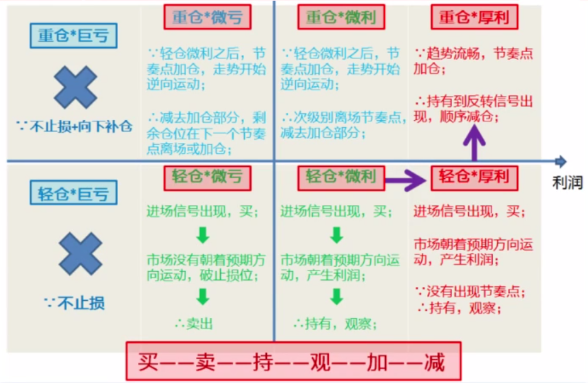

资金管理
====================
# 买、卖点
> 买点：符合盈利模式的进场点。

> 卖点：符合盈利模式的出场点。

## 什么是盈利模式
> 是买、卖、持仓、加减仓的依据，是一套清晰、理性的的盈利策略.

**股市运行的链条、原理**：信息 --> 人 --> 资金、筹码 --> 盘面K线--> K线引申出各种技术指标

## 如何形成一个自己的盈利模式

- **统计**。需在牛市、熊市、震荡市等有牛熊转换市场环境中，作大量的案例统计、分析；
- **验证**。在交易、复盘的过程中去验证自己的盈利模式；
- **量化**。在复盘的过程中去量化自己的交易系统、技术指标，你买卖一只股票用了什么交易策略、哪些技术指标；
- **优化**。保持谨慎、保持学习，不断的优化自己的交易系统、盈利模式；
- **循环改进**。市场是客观的、在变化的，需要与时俱进的优化自己的盈利模式。

# 止损
## 能涨和能买
- 能涨：正在涨，但随时可能转跌，卖出点再哪里？有时候很看好一只股票，如果找不到止损位，或者止损很大、超出了自己的承受范围，也不能买。

- 能买：首先判断能涨，设好止损位，假如判断错了也有保护位。

能涨和能买是两回事，**不设止损不入场**。

# 资金管理

## 加仓资格

## 原则
- 大机会大仓位（月线级别的大牛市，3 到 5 年一轮）
- 小机会小仓位（周线级别的机会，每年一两次）
- 没机会找机会或者等机会（股价波动是板块轮动的，跟着主力资金走）

## 盈利模式
- 看风险承受能力；
- 看盈利模式的止损空间，比如：总资金回撤不超过5%；
- 看持仓盈利情况，有没有资格加仓。

鸡蛋不要放在一个篮子里，通常分仓 2~3 只股票。

交易时，我们能控制的只有止损位和资金管理的仓位。买卖点、止损位和资金管理，每个话题都是我们在交易实战中必须解决的问题。这3个要素保障了资金曲线平滑上线，缺一不可。

# 相关链接
- [01.散户如何建立交易体系](https://github.com/IamDingj/FinancialHub/blob/master/FBSHG/01.%E6%95%A3%E6%88%B7%E5%A6%82%E4%BD%95%E5%BB%BA%E7%AB%8B%E4%BA%A4%E6%98%93%E4%BD%93%E7%B3%BB.md)
- [02.K 线的识别和联系](https://github.com/IamDingj/FinancialHub/blob/master/FBSHG/02.K%20%E7%BA%BF%E7%9A%84%E8%AF%86%E5%88%AB%E5%92%8C%E8%81%94%E7%B3%BB.md)
- [03.节奏点](https://github.com/IamDingj/FinancialHub/blob/master/FBSHG/03.%E8%8A%82%E5%A5%8F%E7%82%B9.md)
- [04.技术指标](https://github.com/IamDingj/FinancialHub/blob/master/FBSHG/04.%E6%8A%80%E6%9C%AF%E6%8C%87%E6%A0%87.md)
- [06.富伯说股总结](https://github.com/IamDingj/FinancialHub/blob/master/FBSHG/06.%E5%AF%8C%E4%BC%AF%E8%AF%B4%E8%82%A1%E6%80%BB%E7%BB%93.md)

