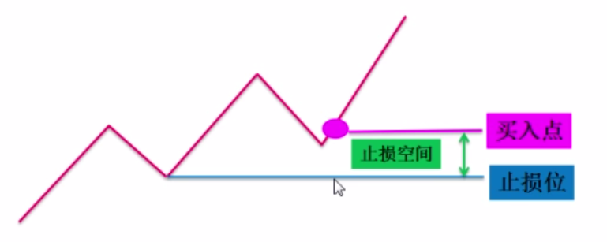

资金管理
====================
# 买、卖点

盈利模式：买、卖、持仓、加减仓的条件。

买点：盈利模式的进场点。

卖点：盈利模式的出场点。

能涨和能买：能涨和能买是两回事，正在涨的股票随时可能转跌，什么时候卖，止损位在哪里？买入前，先进行基本面和技术面的分析，弄清楚他的上涨逻辑，并设好止损位，并定期做好跟踪，若走势和预期偏离较大，则进行调整或者果断止损。

不设止损不入场。

 

# 资金管理

## 原则
- 大机会大仓位（看周K月K、成交量、市场氛围、板块氛围、个股消息）
- 小机会小仓位
- 没机会找机会或者等机会（股价波动是板块轮动的，跟着主力资金走）

## 盈利模式
- 看风险承受能力
- 看止损空间
- 看加仓资格，需要照顾好自己的心态，当下头脑是否清醒，抄底又继续下跌的情况能否接受。

鸡蛋不要放在一个篮子里，通常分仓2~3只股票。

