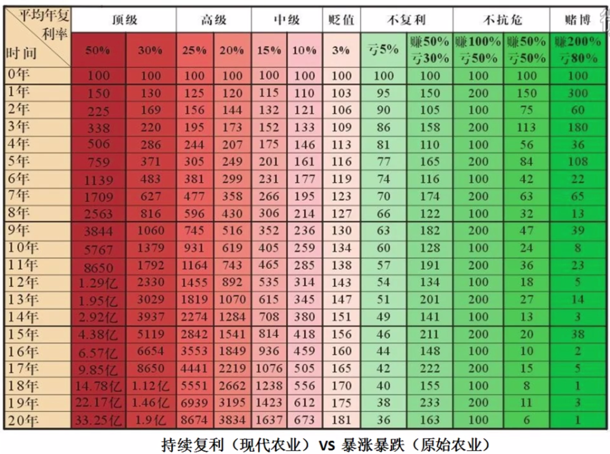

富伯说股总结
====================
# 富伯交易系统简介

_持续复利，不暴涨暴跌。_

_稳定盈利的资金曲线。_

持续复利需要具备的能力：
- 趋势判定
- 交易策略
- 盈利模式

## 趋势判定
- 牛市：周线大盘同时在红、黑线上方
- 熊市：周线大盘同时在红、黑线下方
- 震荡市：周线大盘在红、黑线之间

## 交易策略
顺势而为

### 资金管理
- 牛市：80% 以上
- 熊市：空仓、无风险收益品种（存银行、逆回购、抗熊市风险基金）
- 震荡市：

    - 牛市的震荡：50%
    - 熊市的震荡：20%

### 市道定手法
什么环境用什么样的盈利模式最有效。

## 盈利模式
- 选股：盈利模式
- 交易：买、卖、持仓、观望、加减仓

决策、执行、应变

交易系统的指定，一切围绕持续稳定盈利。

# 体会

认准市场环境，大趋势，热门题材，研究热门题材的优质个股，基本面分析，技术分析。

在股票市场中要赚钱，首先要做好选股工作。怎样才能选好股？归纳起来有六个方面，即：K线形态、均线、技术指标、成交量、热点及主力成本。

# 相关链接
- [01.散户如何建立交易体系](https://github.com/IamDingj/FortuneHub/blob/master/FBSHG/01.%E6%95%A3%E6%88%B7%E5%A6%82%E4%BD%95%E5%BB%BA%E7%AB%8B%E4%BA%A4%E6%98%93%E4%BD%93%E7%B3%BB.md)
- [02.K 线的识别和联系](https://github.com/IamDingj/FortuneHub/blob/master/FBSHG/02.K%E7%BA%BF%E7%9A%84%E8%AF%86%E5%88%AB%E5%92%8C%E8%81%94%E7%B3%BB.md)
- [03.节奏点](https://github.com/IamDingj/FortuneHub/blob/master/FBSHG/03.%E8%8A%82%E5%A5%8F%E7%82%B9.md)
- [04.技术指标](https://github.com/IamDingj/FortuneHub/blob/master/FBSHG/04.%E6%8A%80%E6%9C%AF%E6%8C%87%E6%A0%87.md)
- [05.资金管理](https://github.com/IamDingj/FortuneHub/blob/master/FBSHG/05.%E8%B5%84%E9%87%91%E7%AE%A1%E7%90%86.md)

# 参考 
微信公众号-富伯说股