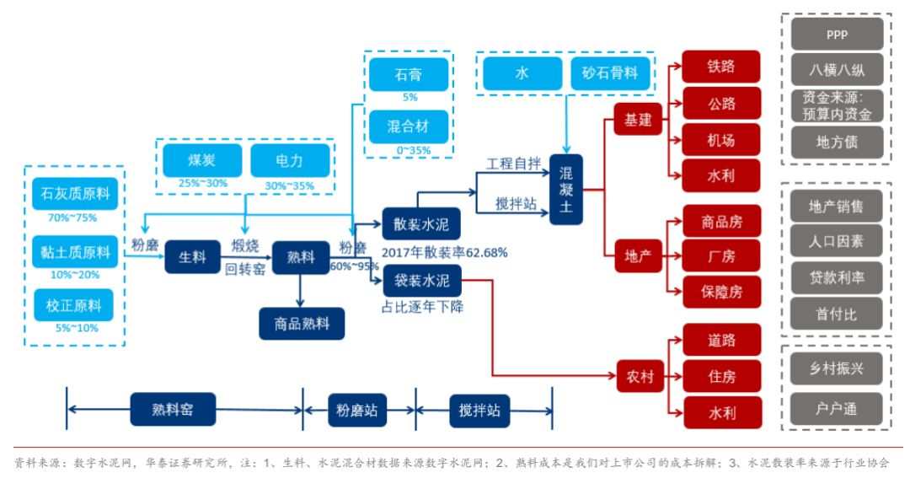
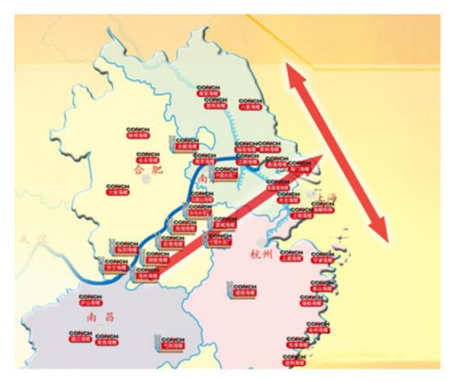

板块分析-水泥
====================

## 一、水泥行业介绍

水泥大家并不陌生，是建筑用的胶黏材料，主要原材料包括石灰石（占比70%~75%）、黏土（10%~20%）、石膏（3%~5%）、铁矿粉（1％～2％）。

具体制造工艺如上，被简单概括为“两磨一烧”。首先，按照一定比例配合原料，经过“粉磨”，制成生料，然后在窖内经过“高温煅烧”，制成熟料，最后再经过二次“粉磨”制成水泥，其中煤炭、电力，提供主要能源供给。

作为建筑的主要材料，水泥用量极大，没有同等量体量的替代品，不过作为同质化产品，竞争还是比较激烈。

**水泥的周期性，主要源于供给与需求扩张/紧缩的不同步**，具体周期表现为：当下游需求端复苏（地产、基建等），水泥价格开始水涨船高 --> 盈利能力的大幅提升，会刺激新产能的快速投放 --> 新产能快速复产后（熟料线建设周期1—1.5年），除了供给端改善，需求端往往也会受地产政策、财政收紧等影响衰减，水泥价格开始回落。

以上，大致就是一个比较典型、完整的水泥周期，所以**水泥股的投资，无论何时，最核心的，一定要从需求和供给两头下手分析，判断当前水泥价格，处于整个周期的哪个位置**。

处于需求端改善，产能扩张的前中期，会是比较好的投资阶段，而一旦需求端收紧，即使这个时候，水泥价格仍处于高位，整个水泥行业盈利仍处于高位，但也要开始谨慎了。

## 二、需求和供给
水泥的需求，主要来源于建筑业，下游的三大主体，分别是地产、基建、农村。**地产和基建，受政策调控影响较大，占到了整个行业需求的7成以上**，农村需要主要是盖房、交通等，需求一直比较稳定。所以分析水泥需求，我们主要看地产和基建就好。

**地产方面，销售、新开工、以及水泥产量之间，几乎是同步进行的**。过去的一年，2019年，地产需求显现了“强韧性”，地产销售和新开工端，虽然整体趋势向下，但斜率比较缓和。去年1-11 月商品房销售面积、房屋新开工面积，分别同比增长 0.2%、8.6%。也正是由于地产需求的强韧性，去年全年的水泥价格，一直保持在相对高位。具体到今年，短期因为疫情超预期，销售、新开工等，均受到了非常大影响，但房地产不同于餐饮、旅游等，消耗的时间是永久性的，毕竟饭不可能再吃一次，春节也不可能再过一次，但是全年的房地产工程量，依然可以通过集中赶工完成。

最差的预期，因为房地产长效机制的建立，以及“因城施政”，需求的波动被进一步抑制，所以**今年的房地产需求，依然会有比较强的韧性**。而好的预期方面，也是大概率，为了完成2020翻番目标，地产政策会有所松绑（正在发生），**全年地产投资预期，也有望从之前市场预期的0增长，增长到5%—10%，这一块，非常有想象力**。

基建方面，需求增长的确定性，要更高。去年的狭义基建投资增速，只有3.8%，确实处于历史相对低位。但今年，截止到2月11号，财政部已经提前下达2020年新增专项债，高达1.29万亿元，从节奏上，是远超市场预期的。同时，在稳增长和翻番的硬性要求下，逆周期调节政策，也会变的非常有想象力，尤其是本周的重要会议上，领导提出，要“加快推动建设一批重大项目”。

相比较需求端，**供给端的分析**，要相对简单一些，主要是**政策方面**：

- 第一，**供给侧改革**。从 09 年“38 号文”开始，中央对水泥产能过剩，就已经保持警惕，16 年“34 号文”，彻底刹住了新增产能的车。**“控制增量、优化存量”**，打破了传统产能周期的传导路径，让行业竞争环境，大幅改善。

- 第二，**蓝天保卫计划**。监管加大对环保指标提标，主要涉及到能耗、矿山、以及产品标准，对粉尘、二氧化硫、碳氧化物的排放标准，进一步收严。一些不符合环保要求的矿山、水泥厂，都会被关闭。

- 第三，**行业集中度的提升**。以上，供给侧改革，环保监管，均会加速中小水泥厂商退出或者被兼并，**行业集中度会进一步向头部集中**。类似的比如空调行业，十几年前，不少分析师已经喊着行业已经到了天花板，但龙头格力美的，依然靠着市占率的提升，活得比较滋润。

## 三、核心竞争力
水泥公司的**长期核心竞争力**，其实就是**成本端的控制**。低成本的竞争优势具体体现在，当行业处于景气上行期，公司会获得更多的扩张机会，赚更多的钱；而当行业处于下行期，其他水泥厂都在亏钱，你还在赚钱时，较高的产能利用率，也会进一步抢占市场份额。

其中，**水泥企业成本的高低，主要依赖于工厂选址、生产规模、物流运输、以及管理水平等**：

- 受制于**覆盖半径**，区域市场的容量是有限的，一个精心选址的熟料基地，具有较强的成本优势，而且客观条件下，并不允许过剩产能 ，一个萝卜一个坑，这块地你占了，别人就不能再进来了。

- **生产规模方面**，公司规模越大，资金越雄厚，竞争力也会更强。比如水泥生产技术方面，配套设备更加先进；比如能源端统一采购（主要是煤炭)，对上游话语权更强；再比如，高品位的矿山资源，是稀缺且不可再生的，龙头水泥企业拿下大型矿山后，20年以上的开采权，会进一步实现区域资源垄断。

- **物流运输方面**，如果能够利用大江大河的运输优势，自然有更强的护城河壁垒。

- **管理水平**，就是如何进一步激发员工的主观能动性，相比较传统的纯国资型企业，员工持股的独特混改路径，更能有效降低企业管理的代理成本。

以行业绝对龙头海螺水泥为例，简单剖析一下公司竞争优势如下：

**海螺水泥最核心竞争优势，在于通过早期布局长江的“T 型”战略，牢牢锁定了资源地和中国水泥最大的消费市场**。所谓的“T 型”战略，就是通过长江水路，以及东部海岸线，共同组成的水运航道，将海螺的生产资源，与华东水泥需求最旺盛的沿江、沿海市场相连接的发展战略。

此外，海螺独创的将熟料基地与粉磨站分开，熟料基地就近建在石灰石资源集中区域，粉磨站利用低价收购的小水泥厂改造而成，利用长江的水运优势，将两者结合起来，从而突破了水泥作为运输半径小、不耐储的区域产品局限，实现了沿长江经济带大规模、低成本、快速化的产业扩张。

低于同行的单位成本，也使得在行业淡季，当其他区域竞争对手都在亏钱的时候，公司依然能够有稳定的盈利回报，并且借机走量，进一步提升市场占有率。

## 四、聊聊市场
短期看，疫情的超预期发展，对水泥市场供需影响，确实比较大，但如果以全年的投资视角，其实是比较有限的：

- **春节疫情期间属于行业淡季**。受下游施工条件的影响，水泥行业有比较明显的淡旺季区分。第一个淡季，大致开始于春季前的春运，民工开始返乡，一直到元宵节后，民工开始陆续复工；第二个淡季，一般是在6—8月份，主要还是受到高温和雨水天气的影响。

- **水泥保质期短，库存量少**。水泥的库房规模，设计之初都是比较小的，主要是考虑到水泥不利于保存，比较容易与空气中的水分反应，从而失效，不利于存储。而疫情过后，工程端的赶工，会导致短期供给端的供不应求，水泥价格也将迎来上涨，这也是其他周期性产品，钢铁、玻璃等（可大量储存），所没有的逻辑。

## 五、举一反三
可以参考如上水泥板块的分析，去思考**如何选行业，选公司等问题**：

- **自上而下的选行业**。宏观方面，基于疫情对经济的较大伤害，政策会加大逆周期调节力度，宽松房地产调控预期。具体到中观利好的行业，包括房地产的上游，水泥、钢铁、建材、工程机械、有色金属、银行、工程承包等。再通过**中观行业景气度的对比比较**，很显然，水泥、工程机械，会脱颖而出，这两个行业本就保持着较高景气度，这次政策预期的催化，行业景气度有望进一步提升。

- **自下而上的选公司**。从宏观到中观，选出行业后，剩下的就是从微观到中观，自下而上的选公司。比如，你选出水泥行业后，紧接着的，就是对水泥行业核心竞争力、行业竞争结构、以及行业所有上市公司的研究。在对行业所有公司基本面、竞争力有了大致了解后，那么，最优质、确定性最高的一家或者几家水泥公司，就脱颖而出了。

# 参考 
- [局座投资笔记-水泥板块分析](https://baike.baidu.com/item/K%E7%BA%BF%E5%9B%BE/85028)