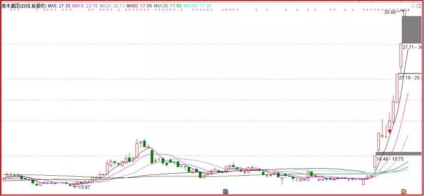
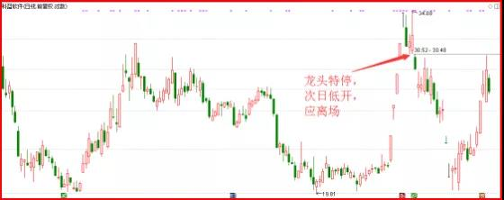
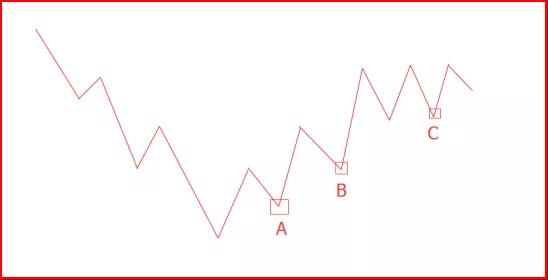

简易交易九法
====================

# 一、10% 追高入场法

### 做法：
> 看好的个股快速拉起，在分时找个回调点，买入 10% 仓位。

### 原理：
第一次启动的主线板块，很容易因抢筹而迅速拉升；为避免回调位依旧很高，可以在刚启动的时候，追高买入10%仓位。

### 适合范围：
第一次启动的主线板块或支线板块。

### 案例：泰禾集团

  
 

主力君1.1号提示房地产为主线板块，房地产1.2号启动，在1.2号可以选择强势个股， 追高买入10%仓位。

有朋友会问，为什么不满仓。很简单，为了避免判断错误。钱是赚不完的，但可以亏完。

_每一次入场，先考虑能亏多少，然后才是想赚多少的问题。_

# 二、跳空离场法

### 做法：
> 若次日跳空低开，并有利空，第一时间减仓或直接离场。

### 原理：
跳空低开，则说明市场资金认可这个利空，开始不惜成本离场，我们则应顺势而为。

### 适合范围：
前日有重大消息。

例子：科蓝软件

  
 
龙头特停，次日低开。说明资金认可利空，这时就应该离场。

这个方法还可以用于判断消息好坏，比如年报业绩预告。次日低开，就是利空；高开，就是利好。盈利超预期的，大涨；亏损超预期的，大跌；业绩不及预期的，调整。

### 三、回调到位买入法

何为调整到位？这其实是**研究股价的运动方式**。

股价的运动方式，可以简化如下：

  
 

这是股价从下跌结束到恢复上涨的常见运动图。这里面的**最理想的回调点，分别是A，B，C**；其分别对应不同阶段：**筑底阶段、上涨阶段、震荡阶段**。
- A点，就是常说的底部形态第二脚；
- B点，就是突破底部形态后回踩颈线位；
- C点，就是震荡区间的底部支撑位。

### 做法：
> 在周线级别的回调位上，日线出现中阳线后，择机入场。

### 原理：
周线回调位支撑力度较强，若日线再出明显阳线，说明支撑大概率有效。

### 适用范围：
周线级别趋势向上的股票。

在实际运行过程中，图形会更复杂。给大家两个建议：

- 所谓支撑位，不要拘泥于某条线或某个价格，而要看一个区间。
- 不要迷信支撑位，要根据市场表现，来确定是否为有效支撑。

所谓回调到位和筑底成功，其实是个伪命题。实际情况是**我们只能预判大致位置，但真正的底和回调位，都是通过不断确认走出来的**，而不是一开始就能精准预测出来的。需强调的是，**针对中小盘股，此法应用的前提是估值合理的优质成长股**。无基本面支撑的回调到位，很可能会是新一波下跌的开始。

# 四、以亏定仓法

### 做法：
> 以你愿意承受的亏损额度，来决定你买入的最大额度。

比如买A股票，最多亏损1万，这股票止损幅度为5%，那你这只票最多只能买1/5%=20万。

若你总资金是100万，那这只票最多占仓位20%。即使亏损，也就亏总资产的1%，风险很小。

_这种做法的好处就是，亏损额很清楚，止损也很清楚，易执行，同时不会亏大钱。_

# 五、一把梭

### 做法：
> 一支股票，一次买入，从不加仓。

比如计划买A股票10万，到买点了，一次性买10万，以后就不再加仓了。

这种做法的好处就是，不用考虑高难度的加仓问题，一旦买完，就等卖点。对了就拿着，错了就止损，执行很简单。一旦做对，就很悠闲。

就买卖而言，大部分时候是在等，要么等买点，要么等卖点。真正交易就那么一刻，买定离手，剩下交给市场，用策略跟随就是。

# 六、异阳战法

异阳：指涨幅比平常K线涨幅明显大的阳线。

### 做法：
- 出异阳线后买；
- 破异阳线底卖；
- 若出新异阳，用新异阳跟随。

### 适用范围：
中期趋势向上的个股，最好是在关键位置起异阳线。

### 案例：

  
 

# 七、均线跟随法

### 做法：
> 用均线跟随股价，若跌破，就离场。

短线常用5日均线；中线常用20日均线。想更精确，可以用动态均线，这需要手工调整均线，让均线包住最近的两个低点。

### 适用范围：
已经出现明显上升趋势的个股

### 案例：以工商银行为例

  
 
经动态调整后，会发现短期是5日线，中期是15日线。然后根据自己定位，用对应的均线跟随就是。

# 八、均线加减仓法
### 做法：
可以利用中短期均线，高抛低吸。

- 破短期线，减半仓；
- 在中期线企稳后，加回来；
- 若破中期线，离场。

**适合对象**：趋势向上的个股；波段操作者。

# 九、分仓买入法
### 做法：
将欲买入股票的仓位，分成三份。先买入一份；每下跌7%，加一份；加满为止。

适用条件：
- 股票大趋势向上；
- 当下处于底部区域；
- 逼空行情。

优质个股在底部区域，很可能因为抢筹，出现逼空式上涨，不给回调机会。大家就可以采用此法。

  
 

若出现A走势，持续上涨，可以喝口汤；若出现B走势，给回调买点，则可以吃到肉。进可攻，退可守，以不变应万变。不管主力怎么玩，都玩不着你。
需强调，此法要严格遵守其适用条件。要是用在垃圾股上，反而容易越套越多。

