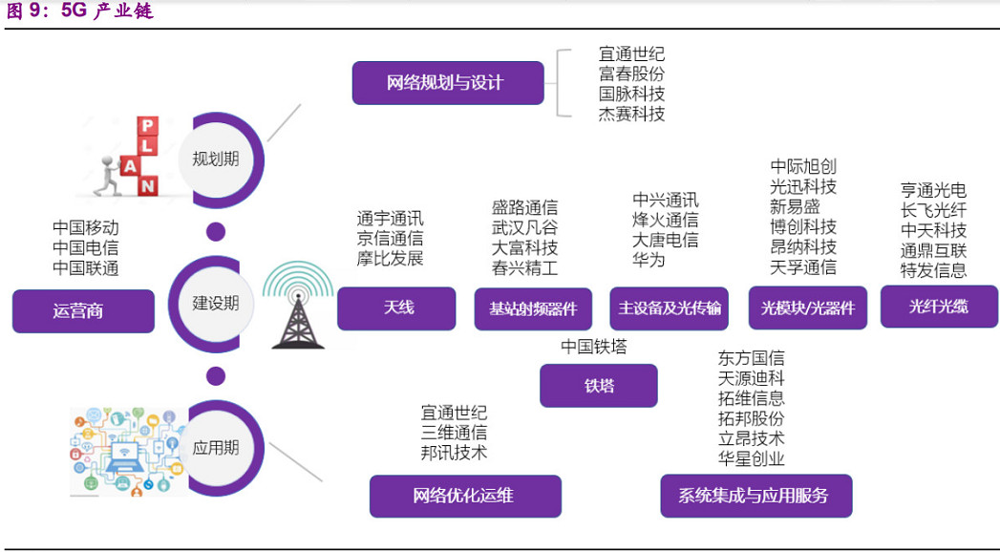
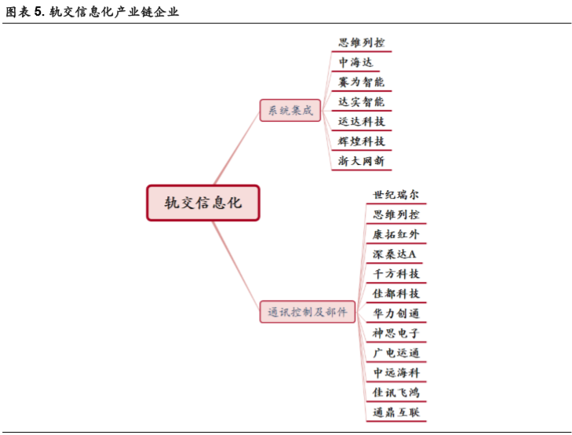
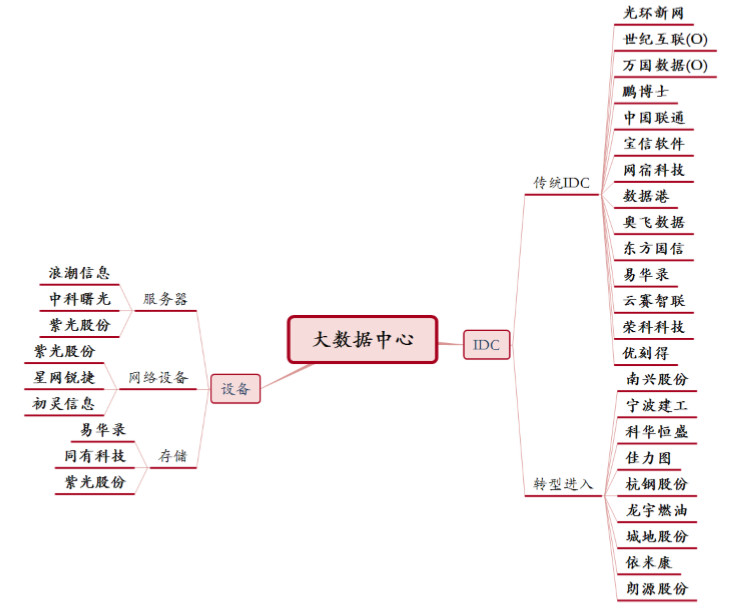
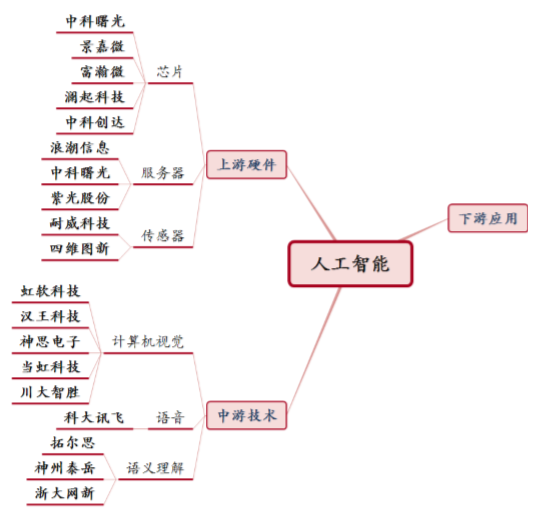
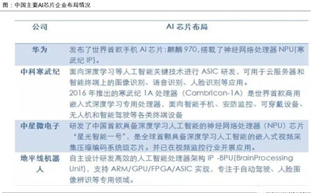
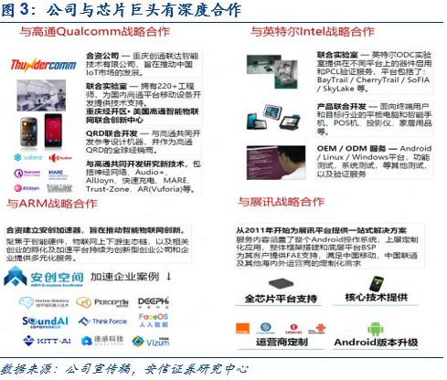
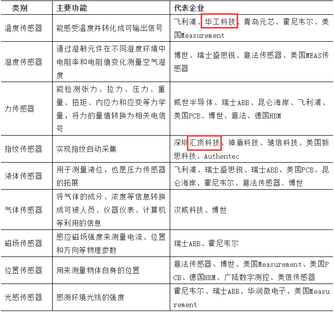
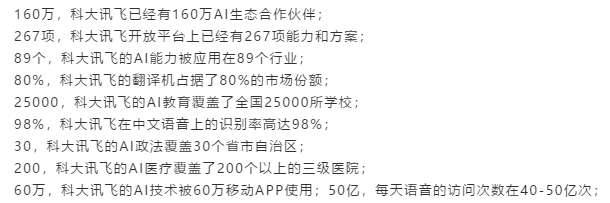
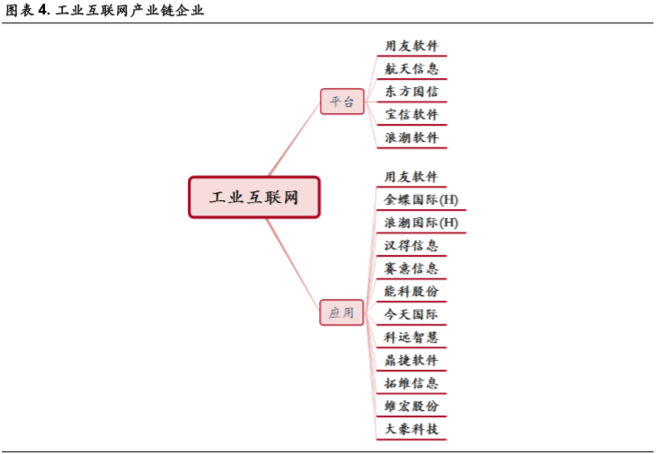

新基建
====================
自3月4日政府强调加快 5G 网络等新型基础设施建设进度后，新基建时常被提及。

市场各个阶段，都会有各阶段的“故事”， 价值投资，业绩为王——蓝筹白马疯涨； 贸易战，利好自主替代——科技股行情； 特斯拉开始交付——新能源车爆发； ...

基建对冲疫情/基建稳经济的“故事”，无疑最为契合当下的市场。

新基建包含的七大领域：**5G 基站、特高压、轨道交通信息化、新能源汽车充电桩、大数据中心、人工智能、工业互联网**。

因为基建涉及的方向很多，资金可选择的方向太多了，而政策对产业链中上游企业带动比较明显，所以下游应用环节投资节点往后推移，主要还是聚焦**中上游的机会**。

# 一、5G 基站

- **网络规划与设计**：宜通世纪、富春股份、国脉科技、杰赛科技
- **天线**：通宇通讯、京信通信
- **射频器件**：大富科技、武汉凡谷、春兴精工、盛路通信
- **主设备**：中兴通讯、烽火通信、大唐电信
- **光模块**：中际旭创、光迅科技、新易盛、博创科技、天孚通信
- **光纤光缆**：亨通光电、长飞光纤、中天科技、通鼎互联、特发信息

### 重点关注

主设备商龙头：**中兴通讯**；基站天线龙头：**通宇通讯**；光模块龙头：**光迅科技**、**中际旭创**；光器件龙头：**天孚通信**；光纤光缆龙头：**长飞光纤**、**亨通光电**。

# 二、特高压

# 三、轨道交通信息化

同样是铁路，城际高铁、城际轨道交通之所以被称为新基建，是因为利用了信息技术和一些自动控制的技术。

### 重点关注

- **赛为智能**：公司早期从事建筑智能化领域，逐步拓展至城市轨道交通、高速铁路、水利等行业，为其提供智能化系统解决方案。   
  公司目前是国内资质门类齐全的智能化系统解决方案提供商之一，拥有建筑智能化系统设计专项甲级资质、计算机信息系统集成壹级资质、建筑智能化工程专承包壹级资质等众多核心资质。

- **佳都科技**：19年12月，工信部公布了“新一代人工智能产业创新重点任务的入围揭榜单位和项目名单”，佳都科技“复杂环境下智能视频监控安检身份识别系统”位列榜单，跻身中国新一代人工智能产业创新的“国家队”。

# 四、新能源汽车充电桩

# 五、大数据中心

大数据产业链的核心，是为终端提供计算的服务器；行业大部分的资本开支，也都是花在服务器设备上。所以，目前相对上游的服务器，确定性较高，业绩也有保证；而后再是IDC（为服务器提供专门的托管和宽带等服务）。

### 重点关注

- **浪潮信息**：服务器龙头。浪潮目前国内市占率第一，全球前三，连续11年在政府行业市场占有率第一。  
  AI领域，浪潮也扮演着重要角色。目前，浪潮已经是百度、阿里和腾讯的AI计算GPU服务器的最主要供应商，占有率达到90%。并与多家人工智能领先公司保持在系统与应用方面的深入紧密合作，在中国的AI计算平台占有率达到60%。

- **宝信软件**：宝钢体系（现在第一大钢铁集团（宝武集团））重要的信息化企业，近几年业绩一直保持稳定增长，19年归母净利润较上年同期增长91%到107%！——背靠大树好乘凉。  
  不完全统计，宝信软件为超过60家宝钢系公司提供软件开发及运维服务，覆盖宝钢系统的钢铁、电子商务、金融等所有业务板块。

- **数据港**：公司属于第三方定制化批发型 IDC 供应商，在运营 15 个数据中心，在建 10 个左右数据中心。公司客户主要为 BAT 尤其是阿里巴巴（与阿里巴巴签订了云业务合作协议，在未来6年合作期间内，承销总金额不低于人民币
  4.35 亿元的阿里云产品/服务）。  
  公司大股东为市北高新集团，背后实控人为静安区国资委。国企背景给了公司资金、拿地方面很大优势。

# 六、人工智能

人工智能AI行业分为上游基础层、中游技术层和下游应用层。

- **基础层**为算力支撑，包括芯片、传感器和算法；
- **技术层**为算法平台，包括语音识别、图像视频识别、文本识别等；
- **应用层**则是各行业的具体应用，如医疗、金融、交通、教育、公共安全、零售、商业服务等。

## 1.上游AI芯片

我国仍处于起步阶段，以中小公司为主，高端芯片主要依赖国外进口，技术水平与发达国家差距较大（国内唯一有竞争力的则是华为芯片）

### 重点关注

- **中科创达**：世界领先的智能终端平台技术提供商。公司与几乎产业所有的芯片巨头和终端设备厂商均有深度合作和磨合，高通、展讯、ARM曾参与公司的历次融资，形成了资本层面的深度绑定。  
  与华为方面，也有长期合作，中科创达为华为第一款人工智能手机芯片麒麟970提供人工智能的IP和软件解决方案。
  

- **通富微电**：国内领先集成电路封测企业，目前已稳居中国前三大和全球前十大集成电路封测企业之列。同时，与 AMD 形成“合资+合作”的强强联合模式，进一步增强公司在客户群体上的优势。技术层面上，填补了我国在 CPU、GPU
  封测领域的空白。在半导体封测领域具备较强的竞争力。

## 2.上游传感器

主要也由国外厂商占据，集中度相对较高。

### 重点关注

- **汇顶科技**：19年以来，包括华为、小米、OPPO、vivo等一线手机品牌在内的新机，均采用汇顶科技的光学屏幕指纹芯片，汇顶科技指纹芯片在新机中导入比例接近90%。  
  除了手机，公司产品应用领域还扩展到平板电脑、笔记本电脑、电子书阅读器等市场，主要客户有华为、Dell、 HP、 Amazon、 Google、 ASUS 等全球知名品牌。同时，公司在
  IoT市场布局的部分产品也实现规模商用，包括华为心晴、咕咚耳机，云丁、小米智能门锁等。

- **华工科技**：华工科技的核心业务覆盖激光先进制造装备、光通信器件、激光全息防伪、传感器。光器件系列业务占42%，激光加工及系列成套设备占34%，敏感光器件占17%。  
  传感器方面，华工全球空调温度传感器市占率超过70%。向三大客户（日本JCS、全球开利、韩国佑理）供货，并有新产品导入飞利浦、日本CK、土耳其阿其力克、韩国三星、LG、伊莱克斯等客户。   
  除此之外，华工科技还有量子通信、创投、独角兽、芯片、物联网、无人驾驶等概念，因为其产品多多少少都有一定的关联。在市场回暖的情况下，华工是能蹭上很多热点的。

## 3.中游技术层

依托基础层的运算平台和数据资源，开发面向不同领域的应用技术。包括**语音识别**、**图像视频识别**、**文本识别**等产业。

语音识别领域具有较高的行业技术壁垒，全球只有少数几家企业具有竞争实力。国外厂商 **Nuance** 领跑，国内**科大讯飞**占据主导地位

**科大讯飞**：国内智能语音和人工智能产业的领导者，中文语音识别技术已处于世界领先地位，并逐渐建立中文智能语音产业生态。

# 七、工业互联网

工业互联网并不是什么新鲜概念，就是**信息技术与制造业融合**所形成的新应用模式，是互联网从消费领域向生产领域的拓展。

政策加持下，过去三年工业互联网平台不断涌现： 2017年，海尔发布COSMOPlat、树根互联发布根云、用友网络发布精智。 2018年，美的集团发布M.IOT、阿里云发布supET、飞龙、飞象……

据统计，全国各类型工业互联网平台数量已达数百家。目前，工业互联网平台势力主要有两方。一是以工业富联、海尔智家、美的集团为代表**有制造基因的企业**；二是以华为、阿里、用友为代表**有IT基因**的企业，在数字化方面有优势。

### 重点关注

**用友网络**：国内领先的企业管理软件及云服务提供商，覆盖国内58%的千亿级企业，56%的500 强企业，以及51%的制造业500强企业。

国内 ERP 整体市场市占率，用友（31%）、SAP（14%）、金蝶（12%）分别位列前三。同时，公司也是华为鲲鹏生态建设重要合作伙伴。

# 参考

- [“新基建”发展白皮书](http://www.qianjia.com/html/2020-03/31_363447.html?from=singlemessage)