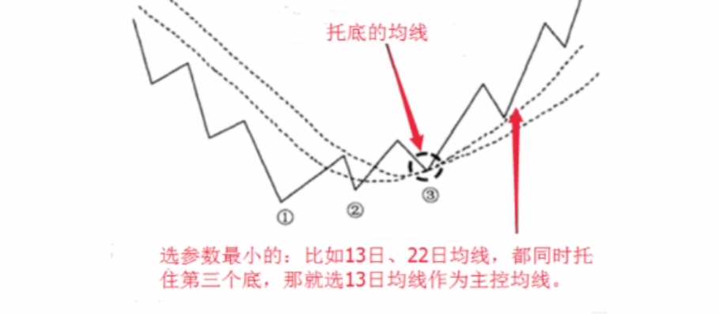

富伯说股笔记
====================
# 1 散户如何建立交易体系

建立一套在股市里属于自己的持续复利的方法。

找几个好股票，做一个有耐心的人。从时间和空间上来看找到一支好股票很难。

一个成功的投资，可以从几个方面学习：

- 建立适合自己的投资交易系统；
- 执行投资交易系统并养成习惯；
- 掌握股市的熊牛发展规律；
- 能在牛市逃顶和熊市抄底。

## 1.1 建立适合自己的投资交易系统

投资交易系统分为两个部分：机会识别、交易控制，两者缺一不可。

### 机会识别

如何识别一个好的机会，可以从以下几点入手：

- **眼光**，投资的眼光应基于扎实的技术功底，明白主流行业的发展趋势，仔细研究利润行业的龙头股和潜力股。
- **判断力**，根据行业的发展趋势和技术面的分析，对股市有自己的见解，不卑不亢，有自己的判断力。
- **盘感**，高手所谓的盘感，多看经典的 K 线图，复盘。

### 交易控制

不论市场如何变化，做好自己的交易控制，打好手上的牌：

- **成本**，如何把握成本
- **利润**，如何保证利润
- **执行力**，建立检查清单，根据检查清单让自己尽可能的保持理性、客观和良好的执行力，并养成好习惯。执行合一。

_打破自己的固定思维，你看好的那支股票有可能不是那么回事，要敢于认错，调适好自己的方向；要有逆向思维，它的下跌逻辑是什么，可能下跌多少（总是反过来想）_。

## 1.2 优秀的技术交易系统需要具备的条件

- 概率高
- 赔率高
- 资金管理

### 只做大概率

进场前，绝对不赌，只做大概率；进场后，看市场，空间是市场给的。因此，资金管理显得非常重要。

### 提高概率

- 牛市：傻子都能赚到钱
- 政策：政策支持的行业/概念；国家坐庄，有资金的追逐就有牛股
- 符合人性：曹刿论战，通常 6 ~ 8 天或 11 ~ 13 天回调一次，把握时间节奏
- 顺应趋势：上涨的时候更容易上涨，下跌的时候更容易下跌；主力均线、量能规律

### 提高赔率

赔率，就是回报与风险比率。如何提高回报与风险比率：

- 原则上盈亏比 > 3:1，例如：止损 1 块钱，上涨空间大于 3 块钱；
- 大级别机会，小级别止损：周线级别的机会，在日线上止损；
- 大顺-中逆-小顺：大趋势向上，有一个回调，同时在小级别上有一个上升再买入；
- 短线过度成中长线：短线赚钱了过度成中长线。

## 1.3 资金管理

原则：利润少低仓位，利润大高仓位

初入场：以损定仓，主动管理资金回撤，不设止损不入场。

- 损：愿意承受的亏损额度
- 无论市场有多凶险，资金回撤是可控的

加减仓：截断亏损，让利润奔跑

- 跌了，不符合逾期，减仓/清仓
- 涨了，符合预期，节奏点加仓

净值曲线即一切：

- 小仓位小亏
- 小仓位小赚
- 大仓位小赚
- 大仓位大赚

_炒股跟时间不成正比，思维要比经验重要的多，形成好的习惯，不断的实践，不要把运气当作你的能力。_

_保持客观、保持理性、保持头脑清醒；盈利模式是有适用边界的，技术是分析、判断的一个依据，不要刻板、教条，股市是人的股市，是活的。_

_学会把赚到的钱往外面提，落袋为安。_

## 1.4 股价的运行流程

**信息 --> 人 --> 资金、筹码 --> 盘面K线--> K线引申出各种技术指标**

技术分析流派，透过 K 线去知道市场正在发生什么，去感觉市场；学技术分析的人无数，但真正入门的不多，需要真正的理解技术分析。**技术**，仅能提供方向和进场信号。只有真正掌握了技术分析，才可以达到 90% 以上的正确率；**上涨空间**无法确定，是进场后才知道的，空间是市场给的。理解透彻技术分析流派，研究热点板块，有资金追逐，空间就更大。

**主力坐庄的基本步骤**：吸货、洗盘、拉升、震仓、出货。

# 2 K 线的概述和运用

## 2.1 K 线的概述

### K 线的定义

K 线又称阴阳线或阴阳烛。它能将每个交易期间的开盘与收盘的涨跌以实体的阴阳线表示出来，并将交易曾初现的最高价及最低价以上影线和下影线形式直观的反映出来。如下图：

### K 线的分类

从形态上分为阳线、阴线和同价线，如下图：

### K 线的作用

常见的几种单个 K 线形态：

- **大阳线（长红）**：开盘价接近于全日的最低价，随后价格一路上扬至最高价处收盘，表示市场买方踊跃，涨势未尽；
- **大阴线（长黑/长绿）**：开盘价接近于全日的最高价，随后价格一路下滑至最低价收盘，表示市场强烈跌势，特别是出现在高价区域，更加危险；
- **下影阳线**：价格一度大幅下滑，但受到买盘势力支持，价格又回升向上，收盘在最高价处，属强势形态；
- **下影阴线**：价格一度大幅下滑后但受到买盘势力支持，价格回升向上，虽然收盘价仍然低于开盘价，也可视为强势。但在高价区出现时，说明价格有回调要求，应注意卖出；
- **上影阳线**：价格冲高回落，涨势受阻，虽然收盘价仍高于开盘价，但上方有阻力，可视为弱势；
- **上影阴线**：价格冲高受阻，涨势受阻，收盘价低于开盘价，上方有阻力，可视为弱势；
- **下十字线**：开盘后价格大幅下滑，但在低位处获得支撑，下方买盘积极主动，最终在最高价附近收盘，属强势。当长下影线出现在低价区时，常常是重要的反转信号；
- **倒十字线**：价格冲高后在高位处遇到强大阻力，最终被迫在开盘价附近收盘。虽有上攻愿望，但市场有修整要求，弱势。当倒十字线出现在高价区时，常常是重要的变盘信号；
- **十字星**：买卖双方势均力敌，走势平稳；但在强势市中，十字星往往成为市场强弱转换的交叉点，后市可能变化；
- **一字线**：四价合一 K 线反映出市场成交清淡，后市难有大的变化；但如果出现在涨停（跌停）处，表明买卖双方力量悬殊太大，后市方向明确，短期难以逆转。

组合 K 线是单个 K 线的组合，可以更加丰富的市场信号。k 线的组合形态很多，其意义也不尽相同，应依据不同价格水平及其变动趋势来分析，后续 K 线运用将详细介绍。

### K 线级别的关系

- 1 个月 K 线 = 4 个周 K 线
- 1 个周 K 线 = 5 个日 K 线
- 1 个日 K 线 = 4 个小时 K 线
- 1 个小时 K 线 = 4 个 15 分钟 K 线

## 2.2 K 线的运用

K 线形态可分为：

- 上升形态和见底形态
- 下跌形态和滞涨形态
- 既是上升形态又是下跌形态

注意，见底不一定上涨，它只能说明股价跌不下去了。股价有可能经过一段时间筑底之后才能回升。后文将介绍几种常见的 K 线组合形态。

### 2.2.1 曙光初现

上升形态和见底形态的 K 线组合，如下图：

#### 特征

- 出现在下跌趋势；
- 由一阴一阳两根 K 线组成；
- 先是一根大阴线或中阴线，接着出现一根大阳线或中阳线，并且阳线实体深入阴线实体的 1/2 出以上。

#### 技术含义

见底信号，后市看涨。

#### 案例

_* 阳线实体深入阴线实体越多，转势信号越强。_

### 2.2.2 旭日东升

属于上升形态和见底形态的 K 线组合，如下图：

#### 特征

- 出现在下跌趋势；
- 由一阴一阳两根 K 线组成；
- 先是一根大阴线或中阴线，接着出现一根高开的大阳线或中阳线，阳线实体的收盘价已高于前一根阴线的开盘价。

#### 技术含义

见底信号，后市看涨。

#### 案例

### 2.2.3 早晨十字星

又称“希望十字星”，属于上升形态和见底形态的 K 线组合，如下图：

#### 特征

- 出现在下跌趋势；
- 由 3 根 K 线组成，第 1 根是阴线，第 2 根是十字线，第 3 根是阳线。第 3 根 K 线实体深入到第 1 根 K 线实体之内。

#### 技术含义

见底信号，后市看涨。

#### 案例

# 3 节奏点

什么是节奏点？

- 涨跌转折
- 跌不动或涨不动的位置

                                                                                                                                                                                                                                                                                                                                                                                                                                                                                                                                                                                                                                                                                                                                                                                                                                                                                                                                                                                                                                                                                                                                                                                                                                                                                                                                                                    

节奏点的分类：

- 时间节奏
- 空间节奏
- 时空共振

## 3.1 时间节奏

>  用于研究多空博弈，弱方逆势运动时间。

弱方，如牛市的空头、熊市的多头。

单波时间窗口：6 ~ 8 / 11 ~ 13

复杂波时间窗口：11 ~ 13

### 原理

多空博弈的**弱势心理**，很脆弱，有规律。

希望心理 -> 失望心理 -> 绝望心理

曹刿论战：一鼓作气 -> 再而衰 -> 三而竭

### 应用

适用于大盘、个股的各个周期级别。

应用步骤：

- 1.先辨势，确定谁是弱势方（逆势波动）
  - 上升趋势的回调
  - 下跌趋势的反弹
  - 震荡市的涨和跌

- 2.逆势的时间窗口 6 ~ 8 / 11 ~ 13

- 3.时间窗口临近，在低级别上找背离，占先机
  - 下降趋势，反弹 6 ~ 8 之后不追高（卖点）
  - 上升趋势，下跌 6 ~ 8 之后不割肉（买点）

### 注意事项

1.时间节奏不是预测，是规律。群体的心理既有规律性，又随环境变化。

2.时间节奏的使用，建立在顺势思维的基础上

- 死多空头，败在逆势
  - 熊市抄底：套牢
  - 牛市逃顶：踏空、做空爆仓 

- 玩震荡的，败在趋势里
  - 技术指标、时间周期，在一些震荡市有用，预测上瘾
  - 遇到单边市：套牢、踏空

## 3.2 空间节奏

找一个支撑或压力的位置。

空间节奏的分类：

- **黄金分割**
- 股性波动率
- 支撑位、压力位

### 黄金分割概念

在黄金分割位置容易反弹或止跌。

### 原理

符合人类美感，自然规律，同样也适用于股市；从行为分析的角度看，认同的人多了，自然就有效。（有点牵强，但股市就是个概率事件）

### 应用

适用于大盘、个股的各个周期级别。

- 趋势改变后，寻找(上升)**回调支撑位**或(下降)**反弹的压力位** (38.2%、61.8%)

  

- 破位或突破后，寻找下跌支撑或上涨的目标位(背离：38.2%、61.8%)

- 共振：时间节奏、空间、背离、指标...

画图：用软件工具（如：通达信）黄金分割，取两个点（最高和最低点）

通信达 -> 工具 -> 画图工具

### 注意事项

- 黄金分割使用级别越大，准确性往往越高；
- 与其他方法共振，准确性更高；
- 不是预测买入的价格，是观察买入节奏的区域；
- 当价格在黄金分割位，进入加速状态时，贪婪与恐惧的情绪会放大，一定要克服。

## 3.3 空间节奏

股市运行两大规律的核心：

- 趋势方向（顺势而为）
- 支撑与压力

### 支撑与压力的概念

- 支撑：是指价格回落中形成的低点，他是由于多方在此买入形成。
- 压力：是指价格上涨中形成的高点，他是由于空方在此卖出形成。

**支撑与阻力的相互转换** 

价格在前期的高点和低点附近都是关键的敏感区域，前期高点都是阻挡，前期低点都是支撑，一旦价格突破前期高点，此高点由阻力位变成支撑位，一旦价格跌破前期支撑，此低点由支撑变为阻力。在确认支撑与阻力的角色转换时，反方突破越深，保持的时间越久，被确认的可靠性就越大。说明如下图：

### 支撑线和压力线的识别

- 看成交量（成交量越大越有效，小心压力位放量）
- 看持续时间（维持原有时间越长越有效）
- 看次数（次数越多越有效）
- 看远近（时间越近越有效）

### 常见的支撑与阻力

- 1、近阶段新高新低位置（可根据黄金分割线找出）
  
   

  
  
- 2、密集成交区域
  
   

- 
  
- 3、重要的整数关口。关口位置本身没有作用，但是在经过市场反复确认后，可能会在某个位置形成很强的支撑或阻力作用，比如近段时间创业板的1900点关口就是阻力位。

- 4、跳空缺口形成的支撑或阻力
  
   

- 
  
- 5、股价多次触及的位置形成的支撑和阻力
  

- 6、趋势线具有支撑或阻力作用
  
   

- 
  
- 7、各种技术形态的颈线具有支撑或阻力作用。比如头肩形，三角形，旗形等，它们的颈线位具有支撑或阻力的作用。 

### 支撑与阻力的买卖策略

- 1、上升趋势中的买卖时机
  

- 2、下降趋势中的买卖时机
  

- 3、支撑与压力的操作策略
  

- 4.上涨到压力区间时，出现放量上涨，卖点（庄家出货，散户进场）

- 5.下降到支撑区间时，出现放量下跌，买点

### 支撑与压力的意义

- 价格暂时被阻止向原有趋势方向运动时，一旦后期被成功收复，趋势将继续按原方向运行。
- 价格无力收复原有失地，被彻底阻止向原有趋势方向运动时，就有可能构成趋势的反转。
- 上升趋势中支撑起主导作用，只有**关键压力位**才有可能决定趋势的反转。
- 下降趋势中阻力起主导作用，只有**关键支撑位**才能对趋势的变化起重要作用。

## 3.3 时空共振

结合时间和空间节奏来分析、判断更为准确。

# 4 技术指标

## 4.1 均线

均线（MA），将某一段时间的收盘价之和除以该周期。如：MA5 指最近 5 个交易日收盘价的均价，即为当天的 5 日均线。

### 4.1.1 常用的均线

- 短期：MA5、MA10
- 中期：MA20、MA30、MA60
- 长期：MA120、MA250

若 3 条(短中长)均线并列上涨，则市场呈多头排列；若 3 条均线并列下跌，则市场呈空头排列。

**空头与多头**:

- _**空头**：是一种交易方式，投资者对自己当前持有的股票前景不看好，认为股价目前处在相对高位上，从而卖出股票。而当股票下跌到一定低点之后又买进股票，从而赚取高低之间的差价，这种交易方式被称为**空头**。股票市场处在下跌趋势的时候，被称为**空头市场**。_

- _**多头**:当大多数投资者对股市前景看好，认为股价还有一定的上涨空间，从而继续持有股票或者买入或者加仓，这种交易方式被称为**多头**。股票处在上升趋势的时候，被为**多头市场**。_

先定级别，再谈趋势。

### 4.1.2 均线的应用

- 葛兰比均线 8 大法则
- 衍生均线 expma、ema (使用指标时注意未来函数)
- 修改“神秘”参数（股市一大谎言）

### 4.1.3 主力均线

在具体的 K 线走势中，经常会发现一条均线，上升趋势时托住 K 线上行；下跌趋势时一直压制 K 线向下运行，假如 K 线突破这条均线，通常后续会出现一个级别较大的调整或趋势开始转向。

#### 如何建立主力均线

通常是多头或空头思维建立的地方：

- **反转后**的第 3 波上涨开始（3买）；
- **一波上涨后展开震荡**，从第 2 波上涨开始建立。

#### 主力均线的用法

- 顺势
  - 寻找趋势分析
  - 大的转折一般是从第三个底开始
  - 主力均线不是对过去负责，而是预判未来转势。
- 节奏
  - 预判调整周期：主力均线 N*2/3  (如：主力均线 30->30\*2/3=20，调整时间为 20 个交易日)

#### 主力均线的意义

用于评价市场群体心理的惯性：

- 趋势像流水，运动有惯性；
- 大的熊牛市都有控盘均线支持；
- 一次趋势往往对应一条均线，这条均线既不敏感也不迟钝；
- 一旦跌破这个控盘均线，就意味着大级别的震荡或反转。

## 4.2 顶底结构

顶底结构是一种反转形态，指 K 线趋势逆转形成的图形，背后是多空博弈从平衡到一边倒的过程。

熟悉常见的顶底结构，弄清楚主力的意图，可以帮助我们去逃顶或者抄底。

### 常见的反转形态

- 头肩形
- 双头（底）形
- 三重顶（底）
- 圆形
- V 形

### 反转形态的注意事项

- 必须事先存在某种趋势，这是反转形态产生的前提；
- 在向上突破的时候伴随着成交量越大，可能性就越强；
- 形态的规模越大，反转的波动就越大；
- 反转形态内的背驰。

参考：《道氏理论》、《主控战略形态学》

## 4.3 MACD 指标

MACD 指标，即指数平滑异同移动平均线指标。用来跟踪股价运行趋势、研判股票买卖时机的技术分析工具。

MACD 指标由 DIFF 快线、DEA 慢线、MACD 柱线和零轴这“三线一轴”组成。通过“三线一轴”的交叉、背离、突破、支撑与阻碍等方式来对股价进行研判。

### 趋势识别

_股价上涨过程中，MACD 随着股价的震荡逐步走高。_

顺势操作是所有投资者的共同理念。MACD 指标中两条曲线每次交叉与位置互换，MACD 指标与股价、指数的背离，都有可能形成股价运动趋势的转向，即由上涨转为下跌趋势，或由下跌转为上涨趋势。不过这种趋势有时属于短期、有时属于长期运行趋势的变化。

通常情况下，出现下列情况，意味着股价处于或即将进入上涨趋势：

- MACD 在 0 轴上方出现黄金交叉，其后 DIFF 快线一直位于 DEA 慢线上方；
- MACD 低位出现底背离，即股价连续创新低，而 MACD 低点却一个比一个高；
- MACD 的两条曲线向右上方倾斜，且 MACD 柱线越来越长，回调时低点一个比一个高；

当股价处于下跌趋势时，MACD 表现出来的特征与上述情形刚好相反。

### MACD 的理解

MACD 指标的构造过程，可以从以下几个方面理解：

- MACD 和均线的关系：MACD 来源于 EMA，所以具有均线指标稳定、能追踪趋势的特点，可以对市场动能做出客观的反应。与此同时，MACD 去掉了均线有时频发出假信号的缺陷，使得 MACD 指标在对中长期趋势的把握上准确率较高；
- MACD 是市场动能最直接的反应：MACD 实际上是围绕两个离差值进行分析，一个是 DIFF(快慢均线的差值，可理解为股价上涨或下跌的速度)，另一个是 MACD 柱线(快慢 DIFF 的差值，可理解为股价上涨或下跌的加速度)；
- MACD 指标的滞后性：MACD 主要反应市场中长期趋势，对股价短期的反应较为滞后，远不如 K 线及时；
- MACD 不适合短线、超短线投资者使用。

# 5 资金管理

## 5.1 盈利模式

盈利模式是一套清晰、理性的的盈利策略；是买、卖、持仓、加减仓的依据。

### 如何形成一个自己的盈利模式

- **统计**。需在牛市、熊市、震荡市等有牛熊转换市场环境中，作大量的案例统计、分析；
- **验证**。在交易、复盘的过程中去验证自己的盈利模式；
- **量化**。在复盘的过程中去量化自己的交易系统、技术指标，你买卖一只股票用了什么交易策略、哪些技术指标；
- **优化**。保持谨慎、保持学习，不断的优化自己的交易系统、盈利模式；
- **循环改进**。市场是客观的、在变化的，需要与时俱进的优化自己的盈利模式。

### 能涨和能买

- 能涨：正在涨，但随时可能转跌，卖出点再哪里？有时候很看好一只股票，如果找不到止损位，或者止损很大、超出了自己的承受范围，也不能买。
- 能买：首先判断能涨，设好止损位，假如判断错了也有保护位。

能涨和能买是两回事，**不设止损不入场**。

## 5.2 资金管理

加仓前，先看一下自己仓位，有没有加仓的资格：

### 原则

- 大机会大仓位（月线级别的大牛市，3 到 5 年一轮）
- 小机会小仓位（周线级别的机会，每年一两次）
- 没机会找机会或者等机会（股价波动是板块轮动的，跟着主力资金走）

### 策略

- 看风险承受能力；
- 看盈利模式的止损空间，比如：总资金回撤不超过5%；
- 看持仓盈利情况，有没有资格加仓。

鸡蛋不要放在一个篮子里，通常分仓 2~3 只股票。

交易时，我们能控制的只有止损位和资金管理的仓位。买卖点、止损位和资金管理，每个话题都是我们在交易实战中必须解决的问题。这3个要素保障了资金曲线平滑上线，缺一不可。

# 6 富伯交易系统简介

持续复利 VS 暴涨暴跌:

持续复利，不暴涨暴跌，稳定盈利的资金曲线。

持续复利需要具备的能力：

- 趋势判定
- 交易策略
- 盈利模式

## 6.1 趋势判定

- 牛市：周线大盘同时在红、黑线上方
- 熊市：周线大盘同时在红、黑线下方
- 震荡市：周线大盘在红、黑线之间

顺势而为。

## 6.2 资金管理

- 牛市：80% 以上
- 熊市：空仓、无风险收益品种（存银行、逆回购、抗熊市风险基金）
- 震荡市：

  - 牛市的震荡：50%
  - 熊市的震荡：20%

## 6.3 盈利模式

- 选股：盈利模式。提前于大盘见底，重心上移的股票。一线龙头会先于板块启动，其次才是板块指数的启动。
- 交易：买、卖、持仓、观望、加减仓

决策、执行、应变。交易系统的指定，一切围绕持续稳定盈利。

# 参考 
- 富伯说股-微信公众号
- [K 线图](https://baike.baidu.com/item/K%E7%BA%BF%E5%9B%BE/85028)
- [如何找支撑位和压力位](https://www.zhihu.com/question/337290434/answer/771411880)
- [教你技术分析（一）——支撑与阻力](https://zhuanlan.zhihu.com/p/35489068)

- [767股票学习网-MACD指标介绍](http://www.net767.com/book/macdrumen/201608/22095.html)