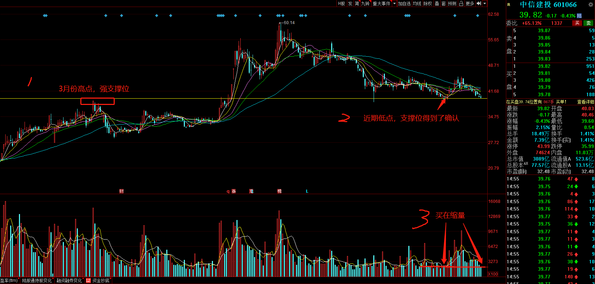

# 我的 2021 年交易日志

2020 年，一场突如其来的疫情，将全球经济打入谷底，年后开盘让菜鸟我吃了两天的跌停，然而风险与机遇并存，很可惜太菜了，没能抓住什么机会。2021
认真做股票的第一年，努力学习，认真选股，坚持每天复盘，做好每一笔交易，搭上国家发展的快车，脱贫、致富。

## 1 年度计划

2021 全球疫情逐渐得到控制，经济缓慢恢复，但我们将面临放水的后遗症，包括货币政策收紧、通货膨胀等问题。

### 机会

- 搭上国家发展快车，认真研读《14 五规划》
- 疫情得到控制，相应板块回暖
- 2022 北京冬奥会

### 风险

- 经济放水后遗症（注意时间节点，什么时候不防水）
- 拜登政府对中国政策（关注新闻，规避风险）
- 机构抱团（抱机构，优质个股，漂亮50）

### 策略

做多新能源、创新药，酒，大仓位做优质个股，尽量选漂亮50；小仓位练习价值投机。

### 票池

|       板块       | 个股                                           |
| :--------------: | ---------------------------------------------- |
| 新能源（515700） | 拓普集团、三花智控、比亚迪、通威股份           |
| 创新药（159992） | 恒瑞医药、药明康德、片仔癀、云南白药           |
|  消费（159928）  | 五粮液、青岛啤酒、泸州老窖                     |
|       科技       | 京东方A、TCL科技、德赛西威、三安光电、长电科技 |
|       军工       | 航发动力、中航沈飞                             |

## 2 个股日志

### 中信建投交易逻辑

一、买什么 先选行业，在选个股 1.2020年股市火热，投资者热情高，连公募基金经理都在圈粉，券商板块业绩确定性高 2.2021一月份，券商没怎么涨，还处在底部，有溢价空间

选哪什么个股--龙头股 中信证券，传统券商，龙一，业绩下滑，不考虑 中金公司，传统券商，龙三，中外合资，次新股，涨的猛，K线参考性不高，待考虑
中信建投，传统券商，龙二，业绩好，股性较好，K线信号明朗，但是最近涨势不如证券ETF，人气有待观察 东方财富，互联网券商，好票，创业板买不了 同花顺，互联网券商，好票，创业板买不了

二、怎么买 一般是，通过K线等技术，结合量能；再结合大盘和板块择时买入。

大盘是否回调到位（还没，已经缩量，到快了），板块是否回调到位（还没，向下空间不大了），中信建投否回调到位（基本到了）

三、风险点 1.感觉米国、三哥又在开始搞事情了 2.节前效应 3.中信建投前一段时间涨势不如证券ETF，担心涨的不够多

## 3 交易心得

