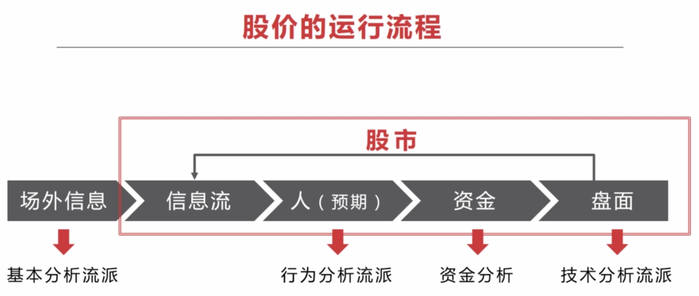

富伯说股 - 散户如何建立交易体系
====================
建立一套在股市里持续复利的属于自己的方法。

找几个好股票，做一个有耐心的人，从时间和空间上来看找一支好股票很难；做一个有耐心的人，也应当是有理性的耐心。

成功的投资，可以从以下几个方面学习：
- 建立适合自己的投资交易系统；
- 执行投资交易系统并养成习惯；
- 掌握股市的熊牛发展规律；
- 能在牛市逃顶和熊市抄底。

# 1、建立适合自己的投资交易系统

## 1.1、建立适合自己的投资交易系统
投资交易系统分为两个部分：机会识别、交易控制。

### 机会识别:
- 眼光，投资的眼光
- 判断力，要有自己的判断力
- 盘感，高手所谓的盘感

### 交易控制（打好手上的牌）：
- 成本，如何把握成本
- 利润，如何保证利润
- 执行力，建立自己的检查清单；人性是有贪婪和恐惧的，根据检查清单让自己尽可能的保持理性、客观和良好的执行力，养成好习惯。

_打破自己的固定思维，你选好的那支股票有可能是不对的，要敢于认错，调适自己的方向；要有逆向思维，它的下跌逻辑是什么，可能下跌多少（总是反过来想）_。

### 股价的运行流程

 
 

技术分析流派，透过 K 线去知道市场正在发生什么，去感觉市场；学技术分析的人无数，但真正入门的不多，需要真正的理解技术分析。

**技术**，仅能提供方向和进场信号。只有真正掌握了技术分析，才可以达到 90% 以上的正确率；但是，**上涨空间**无法确定，是进场后才知道的，空间是市场给的。

研究热点板块，有资金追逐，空间就更大。

优秀的技术交易系统需要具备的条件：

- **概率高**：进场前，决定不赌，只做大概率；进场后，看市场，空间是市场给的。因此，资金管理显得非常重要。
- 赔率高：回报/风险比率要高
- 资金管理：

#### 提高概率：
- 牛市：傻子都能赚到钱
- 政策：政策支持的行业/概念；政府坐庄，资金的追逐
- 符合人性：曹刿论战，6 ~ 8 天 / 11 ~ 13 天，回调一次，时间节奏
- 顺应趋势：上涨的时候更容易上涨，下跌的时候更容易下跌；主力均线、量能规律。

#### 提高赔率：
- 原则 盈亏比>3:1

- 大级别机会，小级别止损：周线级别的机会，在日线上止损

- 大顺-中逆-小顺：

- 短线过度成中长线：短线过度成中长线，跟着主力的节奏
主力坐庄的基本步骤是：吸货、洗盘、拉升、震仓、出货；

#### 资金管理技巧：

原则：利润少低仓位，利润大高仓位

初入场：以损定仓，主动管理资金回撤。
- 损：愿意承受的亏损额度
- 无论市场有多凶险，资金回撤是可控的

加减仓：截断亏损，让利润奔跑
- 跌了，不符合逾期，减仓/清仓
- 涨了，符合预期，节奏点加仓

净值曲线即一切：
- 小仓位小亏
- 小仓位小赚
- 大仓位小赚
- 大仓位大赚

## 1.2、执行投资交易系统并养成习惯

炒股的好坏跟时间不成正比，思维要比经验重要的多，形成好的习惯，不断的实践，不要把运气当作你的能力。

## 1.3、掌握股市的熊牛发展规律

## 1.4、能在牛市逃顶和熊市抄底

# 2、建立起自己的交易手法

**总结一套属于自己的交易手法**，知道“什么时候买，买多少，什么时候卖”。

再好的个股，并不代表当下马上能买。如何选择更好的买点，这就是在完成个股研究之后，需要通过交易手法解决的问题。

选择买点，通常有**基本面的估值分析法**和**技术面的图形分析法**。两者各有优劣，基本面强在**概率**，技术面强在**赔率**和**效率**。

## 3、要有足够的耐心

从一只个股列入股票池，到个股出现良好的交易信号，中间也许间隔一天，也可能间隔一年，甚至更长时间。

股市是不需要频繁交易的，“耐心的等待一记好球”。

# 参考 
[想炒股赚钱，只需做到这三点](https://mp.weixin.qq.com/s/373NGRwCr5b3MJ2CWPGW_A)
